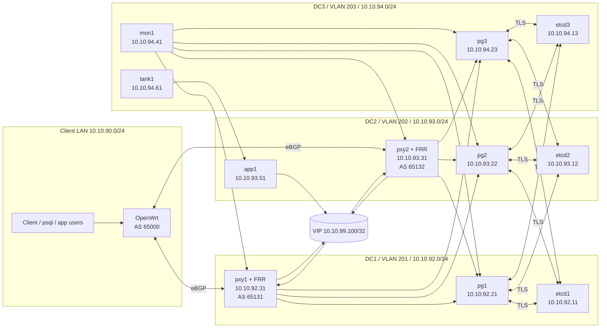

# Отказоустойчивый кластер PostgreSQL: Patroni + etcd + ProxySQL + FRR + BGP

Проект разворачивает отказоустойчивый стенд PostgreSQL на **одном Proxmox-хосте**, но с разделением на **три логических DC / failure-domain** через VLAN.  
Внутри стенда используются:

- **etcd** как DCS для Patroni;
- **Patroni** для автоматического управления кластером PostgreSQL 18;
- **ProxySQL** как единая точка входа для клиентов БД;
- **FRR + eBGP** для анонса сервисного VIP и отказоустойчивого доступа к ProxySQL;
- **pgBackRest** для резервного копирования;
- **Prometheus + Grafana + blackbox-exporter** для наблюдаемости;
- демонстрационное приложение и **Yandex.Tank** для проверки работы кластера под нагрузкой.

Главная идея проекта: **отказ лидера PostgreSQL, одной ProxySQL-ноды или одного логического сегмента не должен приводить к потере доступа к сервису БД**.

---

## Что именно реализовано

### База данных
- Кластер **PostgreSQL 18** на 3 нодах: `pg1`, `pg2`, `pg3`.
- Управление ролями primary/replica через **Patroni**.
- DCS-хранилище на **3-node etcd** с TLS.
- Включён **synchronous_mode** и `synchronous_node_count: 1`.
- Используются `pg_rewind`, replication slots и `pg_stat_statements`.

### Доступ к БД
- Перед PostgreSQL развернуты **две ProxySQL-ноды**: `pxy1` и `pxy2`.
- Клиенты подключаются не к конкретному PostgreSQL-узлу, а к **VIP `10.10.99.100/32`**.
- ProxySQL разделяет трафик на:
  - **writer port**: `6133`
  - **reader port**: `6134`
- Маршрутизация до VIP обеспечивается через **FRR/BGP**.

### Сетевая отказоустойчивость
- На `pxy1` и `pxy2` поднят **FRR**.
- Оба proxy узла устанавливают **eBGP-сессию с OpenWrt**.
- Сервисный VIP объявляется только если локальный ProxySQL жив.
- При потере одной proxy-ноды у маршрутизатора остаётся второй путь до VIP.

### Эксплуатация
- Настроен **pgBackRest** с репозиторием на `mon1`.
- Есть **Prometheus**, **Grafana**, **blackbox-exporter**, `postgres_exporter`, а также textfile-экспортеры для ProxySQL и FRR/BGP.
- Разворачивается демонстрационное приложение и Pretix, чтобы показать, что приложение продолжает работать через VIP.
- Нагрузочное тестирование выполняется с `tank1` через **Yandex.Tank**.

---

## Архитектура стенда



---

## Логическая схема DC

| DC | VLAN | Подсеть | Узлы |
|---|---:|---|---|
| DC1 | 201 | `10.10.92.0/24` | `etcd1`, `pg1`, `pxy1` |
| DC2 | 202 | `10.10.93.0/24` | `etcd2`, `pg2`, `pxy2`, `app1` |
| DC3 | 203 | `10.10.94.0/24` | `etcd3`, `pg3`, `mon1`, `tank1` |

Клиентская сеть: `10.10.90.0/24`  
Сервисный VIP БД: `10.10.99.100/32`

---

## Состав виртуальных машин

| Узел | IP | Роль | CPU | RAM | Disk |
|---|---|---|---:|---:|---:|
| `etcd1` | `10.10.92.11` | etcd | 1 | 1 GB | 12 GB |
| `etcd2` | `10.10.93.12` | etcd | 1 | 1 GB | 12 GB |
| `etcd3` | `10.10.94.13` | etcd | 1 | 1 GB | 12 GB |
| `pg1` | `10.10.92.21` | Patroni / PostgreSQL | 4 | 6 GB | 40 GB |
| `pg2` | `10.10.93.22` | Patroni / PostgreSQL | 4 | 6 GB | 40 GB |
| `pg3` | `10.10.94.23` | Patroni / PostgreSQL | 4 | 6 GB | 40 GB |
| `pxy1` | `10.10.92.31` | ProxySQL + FRR | 2 | 2 GB | 16 GB |
| `pxy2` | `10.10.93.31` | ProxySQL + FRR | 2 | 2 GB | 16 GB |
| `mon1` | `10.10.94.41` | Monitoring + pgBackRest repo | 4 | 4 GB | 80 GB |
| `app1` | `10.10.93.51` | Demo app + Pretix + nginx | 4 | 8 GB | 20 GB |
| `tank1` | `10.10.94.61` | Yandex.Tank | 2 | 2 GB | 20 GB |

---

## Как это работает

### 1. etcd как источник правды
Patroni хранит состояние кластера в **etcd**. Это позволяет всем PostgreSQL-нодам согласованно понимать:
- кто сейчас primary;
- кто может стать новым primary;
- когда запускать failover.

etcd в проекте развернут на трёх узлах и использует **TLS** для client/peer соединений.

### 2. Patroni управляет PostgreSQL-кластером
Каждая PostgreSQL-нода работает под управлением Patroni.  
Patroni:
- поднимает initial bootstrap на `pg1`;
- подключает остальные ноды как replicas;
- следит за leader lock в etcd;
- при отказе primary инициирует автоматический failover.

В конфигурации включены:
- `synchronous_mode: true`
- `synchronous_node_count: 1`
- `use_pg_rewind: true`
- WAL-архивация через `pgBackRest`

### 3. ProxySQL прячет внутреннюю топологию БД
Клиенты работают не напрямую с PostgreSQL, а через ProxySQL:
- порт `6133` — запись в writer hostgroup;
- порт `6134` — чтение из reader hostgroup.

ProxySQL использует мониторинг PostgreSQL и replication hostgroups, поэтому после смены primary продолжает направлять write-трафик в актуальный writer.

### 4. FRR и BGP дают отказоустойчивую точку входа
На `pxy1` и `pxy2` работает FRR. Каждая ProxySQL-нода:
- устанавливает eBGP-соседство с OpenWrt;
- рекламирует только префикс `10.10.99.100/32`;
- делает это **только пока локальный ProxySQL отвечает**.

Проверка реализована через `proxysql-vip-health.sh`:
- если ProxySQL жив, VIP добавляется на loopback;
- если ProxySQL не отвечает, VIP снимается, а маршрут перестаёт рекламироваться.

### 5. Policy routing для исходящего трафика VIP
На proxy-хостах настраивается отдельная policy routing-таблица, чтобы пакеты с исходником VIP корректно уходили через нужный gateway текущего сегмента.

---

## Что даёт эта схема

### Плюсы
- кворум etcd разнесён по трём логическим DC;
- БД переживает отказ primary;
- VIP доступен через две независимые proxy/BGP точки;
- отказ одной proxy-ноды не убивает доступ к кластеру;
- приложение работает через единый адрес доступа;
- есть резервное копирование и мониторинг.

### Ограничения стенда
Важно: это **не геораспределённый production-кластер**, а лабораторный стенд.

Физически всё работает на одном Proxmox-хосте, поэтому:
- падение гипервизора уронит весь стенд;
- единый физический NIC остаётся общей точкой отказа;
- OpenWrt тоже является одиночной edge-точкой.

Корректно называть DC1/DC2/DC3 **логическими ЦОД / failure-domain / routed segments**.

---

## Предварительные требования

### На Proxmox
Нужен:
- один VLAN-aware bridge, например `vmbr0`;
- cloud-init template для клонирования VM;
- доступ по API для Ansible;
- маршрутизатор OpenWrt, который:
  - маршрутизирует `10.10.92.0/24`, `10.10.93.0/24`, `10.10.94.0/24`;
  - поднимает eBGP-сессии с `pxy1` и `pxy2`.

Пример идеи для `/etc/network/interfaces` на PVE:

```ini
auto lo
iface lo inet loopback

auto eno1
iface eno1 inet manual

auto vmbr0
iface vmbr0 inet manual
    bridge-ports eno1
    bridge-stp off
    bridge-fd 0
    bridge-vlan-aware yes
    bridge-vids 2-4094
```

### На управляющей машине
- Linux/macOS shell;
- `python3`;
- доступ к Proxmox API;
- SSH-ключ для cloud-init;
- Ansible-зависимости из `requirements.txt` и `requirements.yml`.

---

## Быстрый старт

### 1. Подготовить окружение

```bash
./bootstrap.sh
source .venv/bin/activate
source ./env.sh
```

Файл `env.sh` экспортирует lab defaults. Для своей среды лучше переопределить параметры через `./.env.local` или переменные окружения:
- доступ к Proxmox API;
- SSH public key;
- адреса шлюзов и VLAN;
- пароли;
- адрес VIP;
- параметры Pretix и Yandex.Tank.

### 2. Полный деплой одним playbook

```bash
ansible-playbook -i inventory/hosts.yml playbooks/site.yml
```

### 3. Либо пошаговый деплой

```bash
ansible-playbook -i inventory/hosts.yml playbooks/create_infra_vms.yml
ansible-playbook -i inventory/hosts.yml playbooks/configure_etcd_cluster.yml
ansible-playbook -i inventory/hosts.yml playbooks/configure_patroni_cluster.yml
ansible-playbook -i inventory/hosts.yml playbooks/finalize_cluster.yml
ansible-playbook -i inventory/hosts.yml playbooks/configure_backup.yml
ansible-playbook -i inventory/hosts.yml playbooks/configure_proxysql.yml
ansible-playbook -i inventory/hosts.yml playbooks/configure_frr.yml
ansible-playbook -i inventory/hosts.yml playbooks/configure_monitoring.yml
ansible-playbook -i inventory/hosts.yml playbooks/configure_app.yml
ansible-playbook -i inventory/hosts.yml playbooks/configure_yandex_tank.yml
```

---

## Сетевые и сервисные параметры

| Сервис | Адрес / порт | Назначение |
|---|---|---|
| PostgreSQL writer | `10.10.99.100:6133` | запись через ProxySQL |
| PostgreSQL reader | `10.10.99.100:6134` | чтение через ProxySQL |
| Patroni REST API | `*:8008` на `pg1/pg2/pg3` | состояние кластера |
| etcd client | `*:2379` | DCS для Patroni |
| etcd peer | `*:2380` | межузловой обмен etcd |
| etcd metrics | `*:2381` | метрики etcd |
| Grafana | `http://10.10.94.41:3000` | дашборды |
| Prometheus | `http://10.10.94.41:9090` | метрики |
| Demo app | `https://10.10.93.51/ha-demo/` | проверка write/read split |
| Pretix | `https://10.10.93.51/` | демонстрационное приложение |

---

## Проверка после деплоя

### Доступность VM

```bash
ansible all_vms -i inventory/hosts.yml -m ping
```

### Проверка etcd

```bash
ansible etcd_nodes -i inventory/hosts.yml -b -m shell -a '
export ETCDCTL_API=3
etcdctl endpoint health --cluster \
  --endpoints=https://10.10.92.11:2379,https://10.10.93.12:2379,https://10.10.94.13:2379 \
  --cacert=/etc/fortpost/tls/ca/fortpost-lab-ca.crt \
  --cert=/etc/fortpost/tls/hosts/$(hostname).crt \
  --key=/etc/fortpost/tls/hosts/$(hostname).key
'
```

### Проверка Patroni

```bash
ansible pg1 -i inventory/hosts.yml -b -m shell -a '/opt/patroni/bin/patronictl -c /etc/patroni/patroni.yml list'
```

Ожидаемо:
- один узел в роли `Leader`;
- два узла в роли `Replica`.

### Проверка подключения к БД через VIP

```bash
PGPASSWORD='<APP_DB_PASSWORD>' psql -h 10.10.99.100 -p 6133 -U appuser -d appdb -c 'select 1;'
PGPASSWORD='<APP_READONLY_PASSWORD>' psql -h 10.10.99.100 -p 6134 -U appreader -d appdb -c 'select now();'
```

### Проверка BGP на proxy-нодах

```bash
ssh <user>@10.10.92.31 'vtysh -c "show bgp ipv4 summary"'
ssh <user>@10.10.93.31 'vtysh -c "show bgp ipv4 summary"'
```

### Проверка приложения

```bash
curl -k https://10.10.93.51/
curl -k https://10.10.93.51/ha-demo/healthz
```

---

## Сценарий демонстрации отказоустойчивости

### 1. Определить текущий primary

```bash
ansible pg1 -i inventory/hosts.yml -b -m shell -a '/opt/patroni/bin/patronictl -c /etc/patroni/patroni.yml list'
```

### 2. Запустить фоновую проверку writer-порта

```bash
watch -n 1 "PGPASSWORD='<APP_DB_PASSWORD>' psql -h 10.10.99.100 -p 6133 -U appuser -d appdb -Atqc 'select inet_server_addr(), pg_is_in_recovery()'"
```

### 3. Принудительно уронить текущий primary
В проекте для этого уже есть playbook:

```bash
ansible-playbook -i inventory/hosts.yml playbooks/failover_primary.yml
```

Этот playbook:
- определяет локальную роль Patroni на каждой PostgreSQL-ноде;
- останавливает `patroni` только на текущем leader;
- заставляет кластер выбрать нового primary.

### 4. Проверить результат
После failover ожидается:
- один из бывших replica станет новым primary;
- ProxySQL начнёт направлять writer-трафик на нового leader;
- доступ к `10.10.99.100:6133` сохранится;
- приложение на `app1` продолжит выполнять запись/чтение.

### 5. Проверить отказ одной proxy-ноды
Например, остановить ProxySQL или FRR на `pxy1`:

```bash
ansible pxy1 -i inventory/hosts.yml -b -m service -a 'name=proxysql state=stopped'
```

Ожидаемое поведение:
- health-check снимет VIP с `lo` на `pxy1`;
- анонс VIP через этот узел исчезнет;
- маршрут через `pxy2` останется рабочим;
- клиентское подключение к VIP не пропадёт.

---

## Резервное копирование

Резервные копии организованы через **pgBackRest**:
- репозиторий находится на `mon1` в `/srv/pgbackrest`;
- stanza создаётся автоматически;
- после настройки выполняется initial full backup;
- далее включены timers:
  - **full backup**: еженедельно, `Sun 03:00`
  - **diff backup**: ежедневно, `02:30`

Это даёт:
- WAL archiving;
- базовую стратегию восстановления;
- возможность проверить recovery на отдельной ВМ.

---

## Мониторинг

На `mon1` разворачиваются:
- **Prometheus**;
- **Grafana**;
- **blackbox-exporter**.

Дополнительно собираются метрики:
- `postgres_exporter` с PostgreSQL-нод;
- `node_exporter` со всех VM;
- textfile-метрики по ProxySQL;
- textfile-метрики по FRR/BGP/VIP;
- метрики Patroni API.

В проекте уже подготовлены дашборды:
- `FortPost HA Overview`
- `FortPost Database Cluster`
- `FortPost Edge / ProxySQL / BGP`
- `FortPost Failover Demo`
- `FortPost ProxySQL PGMode`

---

## Нагрузочное тестирование

Для генерации нагрузки используется `tank1`.

Поддерживаются сценарии:
- `pretix_public`
- `pretix_orders_api`

Подготовка:

```bash
ansible-playbook -i inventory/hosts.yml playbooks/configure_yandex_tank.yml
```

Запуск теста:

```bash
ansible-playbook -i inventory/hosts.yml playbooks/run_tank_pretix.yml
```

Полезный сценарий защиты проекта:
1. запустить нагрузку;
2. сделать failover primary;
3. остановить один из ProxySQL узлов;
4. показать, что приложение и writer endpoint продолжают работать;
5. подтвердить это графиками в Grafana.

---

## Структура репозитория

```text
inventory/                   # инвентарь, IP-адреса, group_vars
playbooks/                   # сценарии развертывания и проверок
roles/etcd/                  # установка и конфигурирование etcd
roles/patroni/               # Patroni + PostgreSQL
roles/proxysql/              # ProxySQL + routing policy
roles/frr/                   # FRR/BGP + VIP health
roles/backup/                # pgBackRest repo/client
roles/monitoring/            # Prometheus / Grafana / blackbox
roles/app/                   # demo app + Pretix + nginx
roles/tank/                  # Yandex.Tank
files/dashboards/            # готовые Grafana dashboards
.generated/tls/              # локально сгенерированные TLS-материалы
```

---

## Почему проект можно защищать как HA-стенд

Проект демонстрирует сразу несколько уровней отказоустойчивости:

1. **Control plane** — отказоустойчивый DCS на etcd.  
2. **Database plane** — автоматическое переключение primary через Patroni.  
3. **Access plane** — единая точка входа через ProxySQL VIP.  
4. **Network plane** — живучесть доступа за счёт FRR/BGP и двух proxy-нод.  
5. **Operations plane** — мониторинг, резервное копирование и нагрузочное тестирование.  


---

## Итог

В результате получаем лабораторный стенд, в котором:
- PostgreSQL развернут в отказоустойчивом режиме;
- смена primary происходит автоматически;
- клиенты подключаются по одному VIP-адресу;
- доступ переживает отказ одной proxy-ноды;
- есть мониторинг, бэкапы и сценарий нагрузочной проверки.

Такой проект хорошо подходит для демонстрации тем:
- HA PostgreSQL;
- Patroni + etcd;
- ProxySQL для PostgreSQL;
- FRR/BGP для отказоустойчивого VIP;
- observability и backup в HA-архитектуре.
