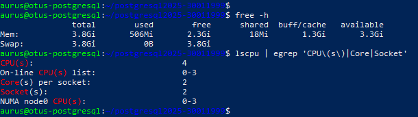
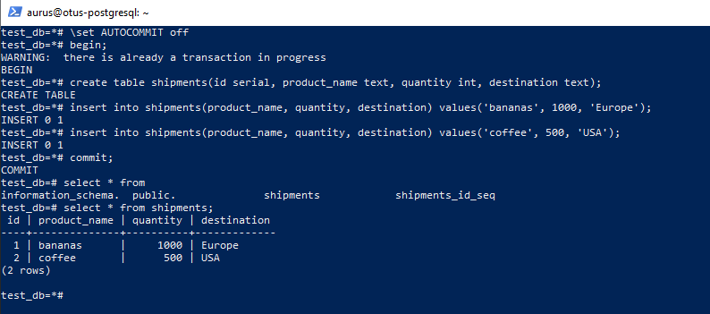

# postgresql2025-30011999 — OTUS: PostgreSQL Advanced (HW #1)

---

## Содержание
- [0. Пререквизиты](#0-пререквизиты)
- [1. Создание проекта и ВМ](#1-создание-проекта-и-вм)
- [2. SSH-ключ и доступ (первая сессия)](#2-ssh-ключ-и-доступ-первая-сессия)
- [3. Установка PostgreSQL 18 (PGDG, apt)](#3-установка-postgresql-18-pgdg-apt)
- [4. Вторая SSH-сессия и psql от postgres](#4-вторая-ssh-сессия-и-psql-от-postgres)
- [5. Выключаем автокоммит и создаём таблицу](#5-выключаем-автокоммит-и-создаём-таблицу)
- [6. Read Committed: проверка изоляции](#6-read-committed-проверка-изоляции)
- [7. Repeatable Read: эксперимент](#7-repeatable-read-эксперимент)
- [8. Приложение (полезные команды)](#8-приложение-полезные-команды)

---

## 0. Пререквизиты
- Ubuntu 24.04 LTS.  
- Пользователь без root (у меня: `aurus`), доступ по SSH.  
- Установлен `git`.

---

## 1. Создание проекта и ВМ
1. Создать проект с именем `postgres2025-30011999` (уникальное имя).  
2. Создать ВМ: 1–2 vCPU, 2–4 GB RAM, Ubuntu (у меня — Proxmox, локально).

**Как выполнено:** локальная ВМ, параметры соответствуют.

---

## 2. SSH-ключ и доступ (первая сессия)
1. Сгенерировать ключ на локальной машине: `ssh-keygen -t ed25519 -C "otus-postgres"`.  
2. Запустить агент и добавить ключ: `eval "$(ssh-agent -s)"`, затем `ssh-add ~/.ssh/id_ed25519`.  
3. Скопировать ключ на ВМ: `ssh-copy-id aurus@10.10.92.254`.  
4. Подключиться (S1): `ssh aurus@10.10.92.254`.

---

## 3. Установка PostgreSQL 18 (PGDG, apt)
1. Обновить индекс пакетов: `sudo apt update`.  
2. Добавить ключ/репозиторий PGDG (Ubuntu 24.04 “noble”):  
   - `curl -fsSL https://www.postgresql.org/media/keys/ACCC4CF8.asc | sudo gpg --dearmor -o /usr/share/keyrings/postgresql-archive-keyring.gpg`  
   - `echo "deb [signed-by=/usr/share/keyrings/postgresql-archive-keyring.gpg] http://apt.postgresql.org/pub/repos/apt/ $(lsb_release -sc)-pgdg main" | sudo tee /etc/apt/sources.list.d/pgdg.list`  
3. Установить: `sudo apt update && sudo apt install -y postgresql-18 postgresql-client-18`.  
4. Проверить сервис: `sudo systemctl status postgresql --no-pager`.

---

## 4. Вторая SSH-сессия и psql от postgres
1. Открыть вторую SSH-сессию (S2): `ssh aurus@10.10.92.254`.  
2. Запустить `psql` под `postgres` **в обеих** сессиях: `sudo -u postgres psql`.  
3. Внутри `psql` выполнить: `SELECT version();` и `\conninfo`.

---

## 5. Выключаем автокоммит и создаём таблицу
1. В S1 в `psql` выключить автокоммит и начать транзакцию: `\set AUTOCOMMIT off`, затем `BEGIN;`.  
2. Создать таблицу `shipments` и вставить 2 строки (`bananas`, `coffee`).  
3. Зафиксировать изменения: `COMMIT;`.  
4. Проверить: `SELECT * FROM shipments;` (ожидаем 2 строки).

**Почему так**  
- `\set AUTOCOMMIT off` — настройка клиента `psql`: команды не коммитятся автоматически, пока не будет `COMMIT;`.  
- До `COMMIT` новые строки и сама таблица **не видны другим сессиям** (если бы их пытались прочитать) — это транзакционная атомарность.  
- В PostgreSQL всё это реализовано через **MVCC**: каждая запись имеет “время жизни” (xmin/xmax) и видна только тем транзакциям, которые должны её видеть.

---

## 6. Read Committed: проверка изоляции
1. В обеих сессиях: `SHOW transaction isolation level;` → `read committed`.  
2. Начать транзакции: S1 `BEGIN;`, S2 `BEGIN;`.  
3. S1 вставляет `'sugar'` (без коммита).  
4. S2 делает `SELECT *` → **строка `'sugar'` не видна**.  
5. S1 делает `COMMIT;`.  
6. S2 снова делает `SELECT *` (в той же своей транзакции) → **строка `'sugar'` уже видна**, затем `COMMIT;`.

**Почему так**  
- Уровень **Read Committed** берёт **свежий снимок данных на каждый отдельный запрос**.  
- Незакоммиченные изменения **никогда** не видны.  
- После коммита в S1, следующий `SELECT` в S2 строит **новый** снимок и уже видит результат — даже если S2 всё ещё внутри своей транзакции.  
- Это поведение — классический компромисс между консистентностью и свежестью: чтения “актуальны” на момент запроса и не блокируются.

---

## 7. Repeatable Read: эксперимент
1. В обеих сессиях: S1 `BEGIN; SET TRANSACTION ISOLATION LEVEL REPEATABLE READ;`, S2 — то же самое (и `SHOW` для проверки).  
2. S1 вставляет `'bananas', 2000, 'Africa'` **без коммита** → S2 `SELECT *`FROM shipments — **новой строки нет**.  
3. S1 делает `COMMIT;`.  
4. S2 снова `SELECT *` (всё ещё в своей RR-транзакции) — **новой строки всё ещё нет**, затем `COMMIT;`.  
5. В новой транзакции/вне транзакции `SELECT *`FROM shipments — **новая строка уже видна**.

**Почему так**  
- В **Repeatable Read** внутри одной транзакции все `SELECT` читают **один и тот же снимок** данных (сформированный в начале транзакции на первом запросе).  
- Поэтому коммит в другой сессии **не “попадает”** в текущую RR-транзакцию: её “видимый мир” фиксирован.  
- Это устраняет “грязные” и **нерепитабельные** чтения, а также большинство фантомов (в PostgreSQL RR ≈ snapshot isolation). Чтобы убирать все аномалии, есть уровень **SERIALIZABLE**.

---

## 9. Приложение (полезные команды)
- `\set AUTOCOMMIT on|off`  
- `BEGIN; COMMIT; ROLLBACK;`  
- `SHOW transaction isolation level;`  
- `SET TRANSACTION ISOLATION LEVEL REPEATABLE READ;`  
- `\dt`, `\q`
