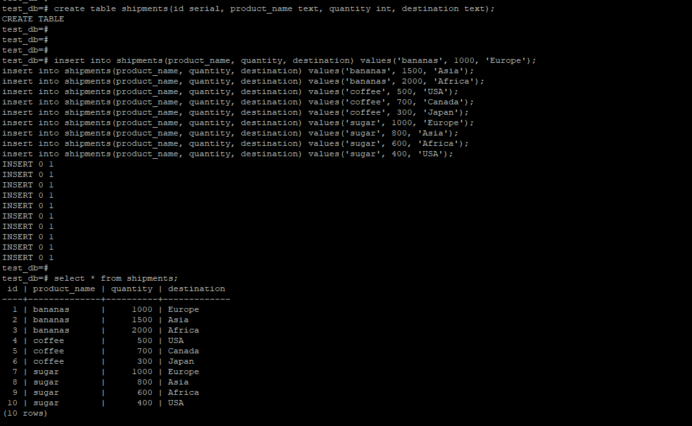
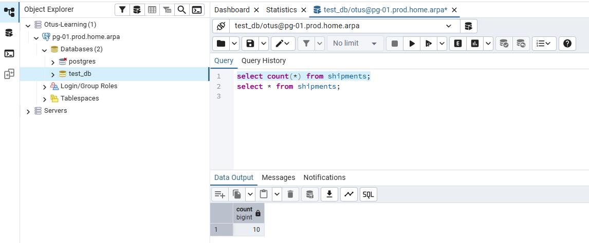
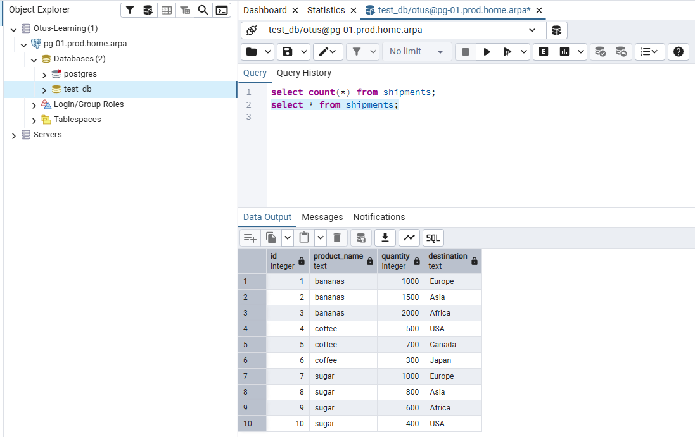
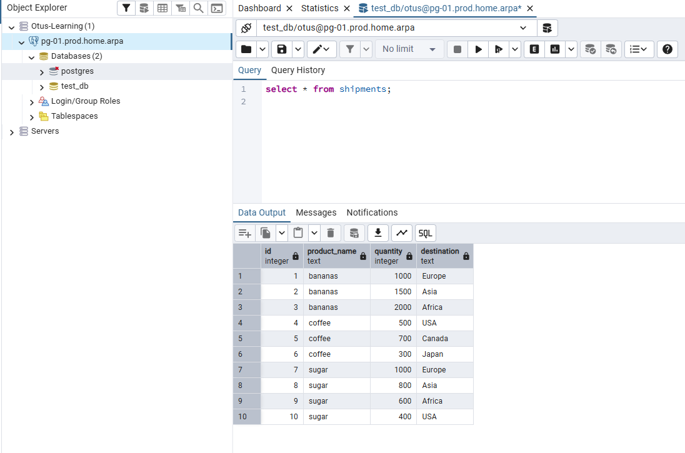
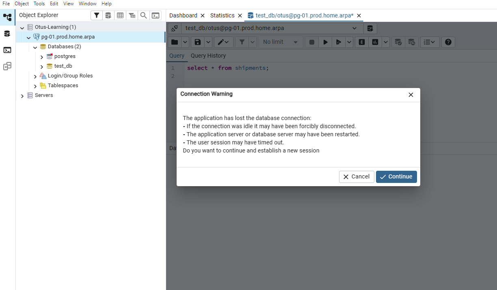
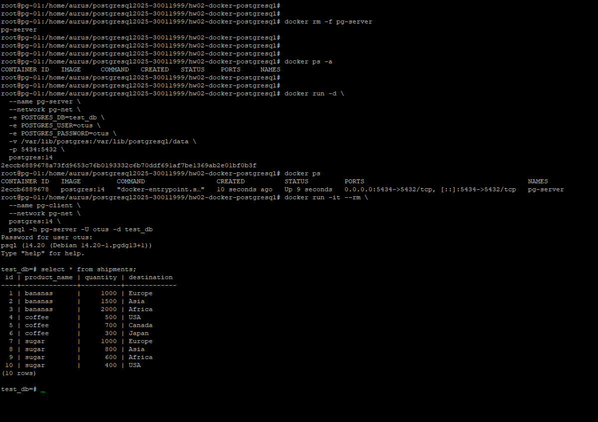

# postgresql2025-30011999 — OTUS: PostgreSQL Advanced
## Домашнее задание №2 — PostgreSQL в Docker

---

## Содержание

0. Пререквизиты  
1. Подготовка репозитория и структуры ДЗ  
2. Установка Docker Engine  
3. Подготовка каталога `/var/lib/postgres`  
4. Создание Docker-сети и развёртывание контейнера с PostgreSQL  
5. Контейнер с клиентом и создание таблицы `shipments`  
6. Подключение к контейнеру с ноутбука (pgAdmin)  
7. Пересоздание контейнера и проверка сохранности данных  
8. Возникшие проблемы и как я их решал  
9. Приложение: полезные команды  

---

## 0. Пререквизиты

Исходные данные:

- Виртуальная машина `pg-01.prod.home.arpa` на Proxmox.
- ОС: Ubuntu 24.04 LTS.
- Уже развёрнут кластер PostgreSQL (Patroni), использующий порт `5432`.
- Доступ по SSH под пользователем `aurus` (sudo без root).
- Установлен и настроен `git`, доступ к GitHub по SSH.

---

## 1. Подготовка репозитория и структуры ДЗ

Подключился по SSH к ВМ:

```bash
ssh aurus@pg-01.prod.home.arpa
````

Клонировал репозиторий курса и создал папку под домашку:

```bash
cd ~
git clone git@github.com:ShinkovA/postgresql2025-30011999.git
cd postgresql2025-30011999

mkdir -p hw02-docker-postgresql/screens
cd hw02-docker-postgresql
```

Скриншоты для этого ДЗ лежат в каталоге `screens/`
(на локальной машине они подготовлены в `Otus/screens/HW02`).

---

## 2. Установка Docker Engine

Docker ставил из стандартных репозиториев Ubuntu:

```bash
sudo apt install -y docker.io
sudo systemctl enable --now docker
docker version
```

Чтобы в дальнейшем можно было работать без `sudo`, добавил пользователя в группу `docker`:

```bash
sudo usermod -aG docker $USER
```

(после этого требуется перелогин).

---

## 3. Подготовка каталога `/var/lib/postgres`

По условию задания данные должны храниться вне контейнера.

Создал каталог:

```bash
sudo mkdir -p /var/lib/postgres
```

Выставил владельца с UID/GID `999:999` — это пользователь `postgres` внутри образа:

```bash
sudo chown 999:999 /var/lib/postgres
```

Теперь PostgreSQL в контейнере может свободно писать данные в этот каталог.

---

## 4. Создание Docker-сети и развёртывание контейнера с PostgreSQL

### 4.1. Создание отдельной сети

Чтобы клиентский контейнер мог обращаться к серверу по имени:

```bash
docker network create pg-net
```

### 4.2. Первая попытка запуска (конфликт порта 5432)

Изначально попробовал запустить контейнер так:

```bash
docker run -d \
  --name pg-server \
  --network pg-net \
  -e POSTGRES_DB=test_db \
  -e POSTGRES_USER=otus \
  -e POSTGRES_PASSWORD=otus \
  -v /var/lib/postgres:/var/lib/postgresql/data \
  -p 5432:5432 \
  postgres:18
```

Контейнер скачался, но старт упал с ошибкой:

> failed to bind host port for 0.0.0.0:5432: address already in use

Причина — на хосте этот порт уже занят живым кластером PostgreSQL (Patroni).

Повторный запуск с другим образом (`postgres:17`) показал новый конфликт — по имени контейнера:

> the container name "/pg-server" is already in use

Контейнер был в статусе `Created`. Я его удалил:

```bash
docker ps -a
docker rm pg-server
```

### 4.3. Успешный запуск PostgreSQL 14 на отдельном порту

Дальше использовал образ `postgres:14` и другой порт на хосте (`5434`),
оставив внутри контейнера стандартный `5432`:

```bash
docker run -d \
  --name pg-server \
  --network pg-net \
  -e POSTGRES_DB=test_db \
  -e POSTGRES_USER=otus \
  -e POSTGRES_PASSWORD=otus \
  -v /var/lib/postgres:/var/lib/postgresql/data \
  -p 5434:5432 \
  postgres:14
```

Проверка:

```bash
docker ps
docker logs pg-server
```

В логах видно успешную инициализацию кластера и старт PostgreSQL 14.

---

## 5. Контейнер с клиентом и создание таблицы `shipments`

Подключился к серверному контейнеру из отдельного контейнера-клиента:

```bash
docker run -it --rm \
  --name pg-client \
  --network pg-net \
  postgres:14 \
  psql -h pg-server -U otus -d test_db
```

Пароль пользователя `otus`: **otus**.

Внутри `psql` создал таблицу и заполнил её данными:

```sql
create table shipments(
    id serial,
    product_name text,
    quantity int,
    destination text
);

insert into shipments(product_name, quantity, destination) values('bananas', 1000, 'Europe');
insert into shipments(product_name, quantity, destination) values('bananas', 1500, 'Asia');
insert into shipments(product_name, quantity, destination) values('bananas', 2000, 'Africa');
insert into shipments(product_name, quantity, destination) values('coffee', 500, 'USA');
insert into shipments(product_name, quantity, destination) values('coffee', 700, 'Canada');
insert into shipments(product_name, quantity, destination) values('coffee', 300, 'Japan');
insert into shipments(product_name, quantity, destination) values('sugar', 1000, 'Europe');
insert into shipments(product_name, quantity, destination) values('sugar', 800, 'Asia');
insert into shipments(product_name, quantity, destination) values('sugar', 600, 'Africa');
insert into shipments(product_name, quantity, destination) values('sugar', 400, 'USA');

select * from shipments;
```

Результат:



---

## 6. Подключение к контейнеру с ноутбука (pgAdmin)

На рабочем компьютере использовал pgAdmin, чтобы проверить подключение «снаружи».

Параметры подключения:

* Host: `pg-01.prod.home.arpa` (или IP сервера)
* Port: `5434`
* Database: `test_db`
* Username: `otus`
* Password: `otus`

После подключения выполнил:

```sql
select count(*) from shipments;
select * from shipments;
```

Скриншоты:





---

## 7. Пересоздание контейнера и проверка сохранности данных

Чтобы убедиться, что данные живут в каталоге на хосте, а не внутри контейнера:

Удалил контейнер с сервером:

```bash
docker rm -f pg-server
docker ps -a
```

Снова запустил его с теми же параметрами (важно: тот же маунт и тот же порт):

```bash
docker run -d \
  --name pg-server \
  --network pg-net \
  -e POSTGRES_DB=test_db \
  -e POSTGRES_USER=otus \
  -e POSTGRES_PASSWORD=otus \
  -v /var/lib/postgres:/var/lib/postgresql/data \
  -p 5434:5432 \
  postgres:14
```

Проверил данные через клиентский контейнер:

```bash
docker run -it --rm \
  --name pg-client \
  --network pg-net \
  postgres:14 \
  psql -h pg-server -U otus -d test_db

select * from shipments;
```

Таблица и все 10 строк остались на месте:



При этом pgAdmin показал предупреждение о потере соединения:



После нажатия **Continue** и переподключения данные также были на месте.

Отдельный скриншот с командами удаления и повторного запуска контейнера:



---

## 8. Возникшие проблемы и как я их решал

### 1. Конфликт порта 5432

При первом запуске с `-p 5432:5432` Docker вернул ошибку:

> address already in use

потому что порт уже использовал существующий кластер PostgreSQL (Patroni).

**Решение:** использовать на хосте другой порт (`5434`), оставив внутри контейнера стандартный `5432`:

```bash
-p 5434:5432
```

---

### 2. Конфликт имени контейнера `/pg-server`

После неудачного старта контейнер остался в статусе `Created`, и повторный `docker run`
выдал сообщение:

> the container name "/pg-server" is already in use

**Решение:** посмотреть список всех контейнеров и удалить конфликтующий:

```bash
docker ps -a
docker rm pg-server
```

---

### 3. Опечатка в команде удаления контейнера

Написал:

```bash
docker -rm -f pg-server
```

и получил:

> unknown shorthand flag: 'r' in -rm

**Исправление:**

```bash
docker rm -f pg-server
```

---

### 4. Потеря соединения в pgAdmin после пересоздания контейнера

После удаления и нового запуска контейнера pgAdmin показал окно:

> The application has lost the database connection…

Нажал **Continue**, заново установил соединение и убедился, что данные в `shipments` сохранились.

---

## 9. Приложение: полезные команды

### Docker

```bash
# Проверка состояния
docker ps
docker ps -a
docker logs pg-server

# Создание сети
docker network create pg-net

# Запуск контейнера с PostgreSQL
docker run -d \
  --name pg-server \
  --network pg-net \
  -e POSTGRES_DB=test_db \
  -e POSTGRES_USER=otus \
  -e POSTGRES_PASSWORD=otus \
  -v /var/lib/postgres:/var/lib/postgresql/data \
  -p 5434:5432 \
  postgres:14

# Остановка и удаление контейнера
docker rm -f pg-server
```

### psql внутри клиентского контейнера

```bash
docker run -it --rm \
  --name pg-client \
  --network pg-net \
  postgres:14 \
  psql -h pg-server -U otus -d test_db

-- Внутри psql:
\dt
select count(*) from shipments;
select * from shipments;
\q
```

---

## Вывод

* Развернул Docker на ВМ с уже работавшим кластером PostgreSQL.
* Запустил контейнер с PostgreSQL 14, смонтировав данные в `/var/lib/postgres`.
* Подключился к серверу из клиентского контейнера и создал таблицу `shipments` с данными.
* Подключился к контейнеру с ноутбука (pgAdmin) и проверил содержимое таблицы.
* Удалил контейнер и пересоздал его, убедившись, что данные сохранились за счёт маунта каталога.

Цель задания — установка и настройка PostgreSQL в Docker с сохранностью данных при пересоздании контейнера — выполнена.

````
