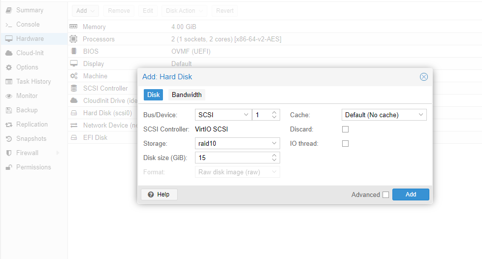
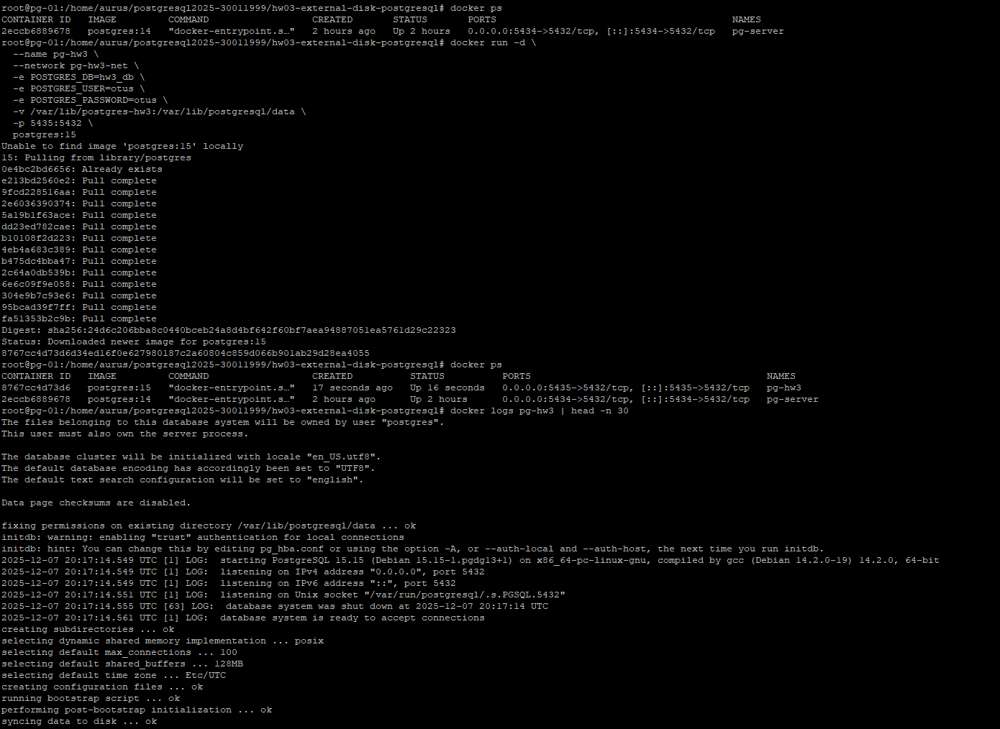
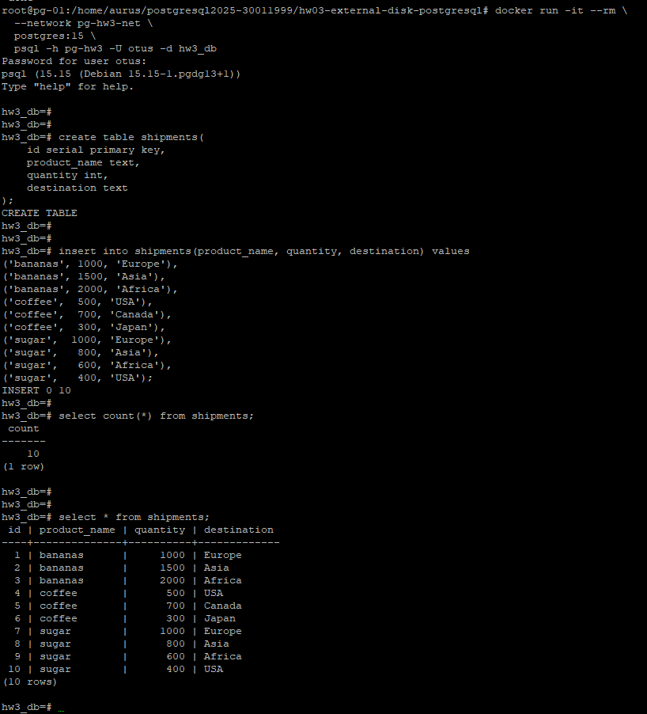

# HW #3 — PostgreSQL на внешнем диске

Домашнее задание по курсу **OTUS: PostgreSQL Advanced**.

Цель работы:

- подключить и инициализировать дополнительный диск;
- перенести данные PostgreSQL на новое хранилище;
- убедиться, что база и данные (включая WAL) корректно работают с внешнего диска.

---

## 1. Стенд

- ВМ с **Ubuntu 20.04**.
- Уже был контейнер `postgres:14` (`pg-server`) на порту `5434` — его не трогаем.
- Для ДЗ поднимаем отдельный кластер PostgreSQL 15 в Docker и выносим его данные на отдельный диск.

---

## 2. Добавление внешнего диска к ВМ

В панели управления (Proxmox) к виртуальной машине добавлен новый диск:

- тип: **SCSI / VirtIO SCSI**;
- storage: `raid10`;
- размер: **15 GiB**.

Скрин настроек диска:



После добавления диск в системе виден как `/dev/sdb`:

```bash
lsblk
NAME    MAJ:MIN RM  SIZE RO TYPE MOUNTPOINTS
sda       8:0    0   40G  0 disk
├─sda1    8:1    0   39G  0 part /
├─sda14   8:14   0    4M  0 part
├─sda15   8:15   0  106M  0 part /boot/efi
└─sda16 259:0    0  913M  0 part /boot
sdb       8:16   0   15G  0 disk
sr0      11:0    1    4M  0 rom
````

---

## 3. Инициализация внешнего диска и монтирование

### 3.1. Разметка диска

Создаю на `/dev/sdb` один раздел:

```bash
fdisk /dev/sdb
# n -> p -> 1 -> default first sector -> default last sector
# w — запись таблицы разделов
```

Проверяю:

```bash
lsblk
sdb       8:16   0   15G  0 disk
└─sdb1    8:17   0   15G  0 part
```

### 3.2. Создание файловой системы

```bash
mkfs.ext4 /dev/sdb1
```

### 3.3. Точка монтирования и fstab

Создаю директорию и прописываю диск в `fstab` по UUID:

```bash
mkdir -p /mnt/pg-hw3
blkid /dev/sdb1
# UUID="431433dc-07ce-48a7-8ee7-9200a7980e58" ...
```

Фрагмент `/etc/fstab`:

```fstab
UUID=431433dc-07ce-48a7-8ee7-9200a7980e58  /mnt/pg-hw3  ext4  defaults  0  2
```

Применяю изменения:

```bash
systemctl daemon-reload
mount -a
df -h | grep pg-hw3
# /dev/sdb1        15G   24K   14G   1% /mnt/pg-hw3
```

---

## 4. Развёртывание PostgreSQL 15 (исходно на системном диске)

### 4.1. Подготовка директории под данные

```bash
mkdir -p /var/lib/postgres-hw3
chown 999:999 /var/lib/postgres-hw3
```

`999:999` — UID/GID пользователя `postgres` внутри контейнера.

Создаю отдельную Docker-сеть:

```bash
docker network create pg-hw3-net
```

### 4.2. Запуск контейнера PostgreSQL 15

```bash
docker run -d \
  --name pg-hw3 \
  --network pg-hw3-net \
  -e POSTGRES_DB=hw3_db \
  -e POSTGRES_USER=otus \
  -e POSTGRES_PASSWORD=otus \
  -v /var/lib/postgres-hw3:/var/lib/postgresql/data \
  -p 5435:5432 \
  postgres:15
```

Проверка контейнера и логов:

```bash
docker ps
docker logs pg-hw3 | head -n 30
```

Скрин запуска контейнера и вывода логов:



---

## 5. Создание таблицы перевозок и наполнение данными

Подключаюсь к базе из временного контейнера:

```bash
docker run -it --rm \
  --network pg-hw3-net \
  postgres:15 \
  psql -h pg-hw3 -U otus -d hw3_db
```

Создаю таблицу `shipments` и вставляю тестовые данные:

```sql
create table shipments(
    id serial primary key,
    product_name text,
    quantity int,
    destination text
);

insert into shipments(product_name, quantity, destination) values
('bananas', 1000, 'Europe'),
('bananas', 1500, 'Asia'),
('bananas', 2000, 'Africa'),
('coffee',  500, 'USA'),
('coffee',  700, 'Canada'),
('coffee',  300, 'Japan'),
('sugar',  1000, 'Europe'),
('sugar',   800, 'Asia'),
('sugar',   600, 'Africa'),
('sugar',   400, 'USA');
```

Проверка:

```sql
select count(*) from shipments;
select * from shipments;
```

Скрин с созданием таблицы и выборкой данных:



---

## 6. Перенос данных PostgreSQL на внешний диск

### 6.1. Остановка контейнера и копирование данных

Останавливаю и удаляю контейнер, чтобы данные не менялись во время переноса:

```bash
docker stop pg-hw3
docker rm pg-hw3
```

Создаю директорию для кластера на внешнем диске и копирую туда данные:

```bash
mkdir -p /mnt/pg-hw3/postgres

rsync -aH --progress /var/lib/postgres-hw3/ /mnt/pg-hw3/postgres/
mv /var/lib/postgres-hw3 /var/lib/postgres-hw3.bak
chown -R 999:999 /mnt/pg-hw3/postgres
```

### 6.2. Перезапуск контейнера с новым путём данных

Теперь поднимаю контейнер, но монтирую уже внешний диск:

```bash
docker run -d \
  --name pg-hw3 \
  --network pg-hw3-net \
  -e POSTGRES_DB=hw3_db \
  -e POSTGRES_USER=otus \
  -e POSTGRES_PASSWORD=otus \
  -v /mnt/pg-hw3/postgres:/var/lib/postgresql/data \
  -p 5435:5432 \
  postgres:15
```

В логах видно, что каталог данных уже содержит инициализированный кластер, поэтому `initdb` пропускается:

```text
PostgreSQL Database directory appears to contain a database; Skipping initialization
...
database system is ready to accept connections
```

---

## 7. Проверка целостности данных после переноса

Подключаюсь к базе и проверяю таблицу:

```bash
docker run -it --rm \
  --network pg-hw3-net \
  postgres:15 \
  psql -h pg-hw3 -U otus -d hw3_db

select count(*) from shipments;
select * from shipments;
```

Результат:

* `count(*) = 10`;
* все 10 записей в `shipments` сохранены.

Также проверяю, что том действительно находится на внешнем диске:

```bash
lsblk
df -h | grep pg-hw3
```

Вывод показывает, что `/dev/sdb1` (15G) смонтирован на `/mnt/pg-hw3`, а контейнер использует этот путь как `PGDATA`.

---

## 8. Приложение: скриншоты

Скриншоты, лежащие в каталоге `hw03-external-disk-postgresql/screens`:

1. `add-hdd-proxmox.png` — добавление нового диска в Proxmox.
2. `create-pg-15.png` — запуск контейнера PostgreSQL 15 и вывод логов инициализации.
3. `create-and-insert.png` — создание таблицы `shipments`, вставка данных и проверка выборкой.

---

## 9. Выводы

1. К ВМ успешно подключён внешний диск, на нём создан ext4-раздел и настроено автоматическое монтирование через `fstab`.
2. Кластер PostgreSQL 15 развернут в Docker, создана тестовая таблица с данными о перевозках.
3. Данные кластера перенесены с системного диска на внешний диск с помощью `rsync`.
4. После перезапуска контейнера с новым volume все данные в таблице `shipments` сохранились.
5. Использование отдельного диска под данные PostgreSQL повышает отказоустойчивость: в случае проблем с основной ВМ данные остаются на отдельном хранилище и могут быть подключены к другой ВМ.
