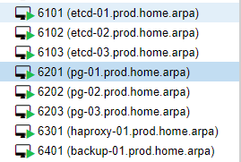
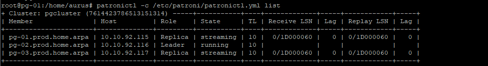
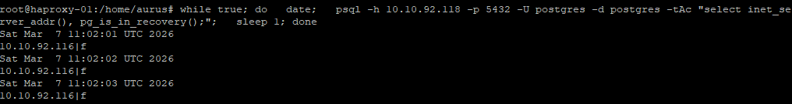
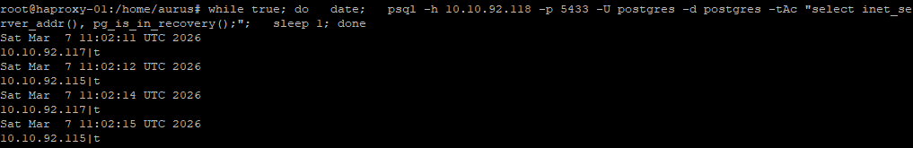
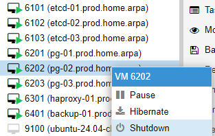
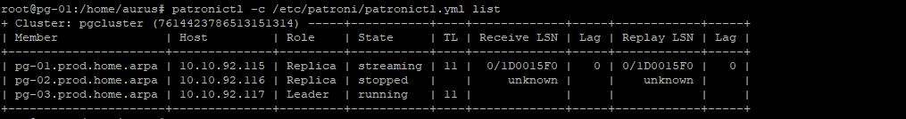
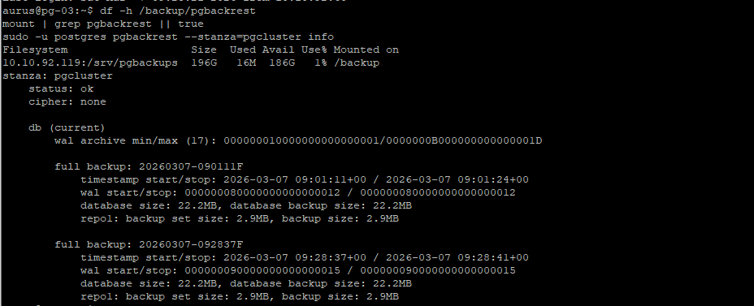

````markdown
# HW04 — Patroni HA (3x etcd, 3x PostgreSQL/Patroni, HAProxy) + pgBackRest (NFS repo)

Домашнее задание: **Высокая доступность: развертывание Patroni**  
Цель: развернуть отказоустойчивый кластер PostgreSQL с Patroni + проверить failover + настроить бэкапы.

---

## 0) Архитектура

### Компоненты

- **etcd (DCS):** 3 ВМ
- **PostgreSQL + Patroni:** 3 ВМ
- **HAProxy:** 1 ВМ (балансировщик)
- **Backup server:** 1 ВМ + отдельный диск **200GB** под репозиторий pgBackRest (экспорт по NFS)

### Сеть и порты

- Patroni REST API: `:8008` (на каждой PG-ноде)
- PostgreSQL: `:5432` (на каждой PG-ноде, управляется Patroni)
- HAProxy:
  - `:5432` → **leader** (writes)
  - `:5433` → **replicas** (reads, round-robin)
  - `:7000` → stats UI
- etcd: `:2379` (client)
- NFS: `:2049` (backup server)

### Виртуальные машины в Proxmox



---

## 1) IP-план (как в стенде)

> Если у вас другой стенд — адаптируйте `inventory/group_vars/all.yml`.

- etcd:
  - `etcd-01.prod.home.arpa` → `10.10.92.112`
  - `etcd-02.prod.home.arpa` → `10.10.92.113`
  - `etcd-03.prod.home.arpa` → `10.10.92.114`
- Patroni/PostgreSQL:
  - `pg-01.prod.home.arpa` → `10.10.92.115`
  - `pg-02.prod.home.arpa` → `10.10.92.116`
  - `pg-03.prod.home.arpa` → `10.10.92.117`
- HAProxy:
  - `haproxy-01.prod.home.arpa` → `10.10.92.118`
- Backup server:
  - `backup-01.prod.home.arpa` → `10.10.92.119`

---

## 2) Требования

### На control-host (где запускаем Ansible)

- Python 3 + venv
- Доступ по сети до Proxmox API
- SSH ключ (`~/.ssh/id_ed25519.pub`) — будет прокинут в ВМ через cloud-init
- DNS (или /etc/hosts), чтобы резолвились имена `*.prod.home.arpa`
  *(в моём стенде DNS через AdGuard `10.10.92.53`)*

### На Proxmox

- Шаблон cloud-init VM с известным `VMID` (например `9100`)
- API token (user/token_id/token_secret)

---

## 3) Развертывание “из коробки” (создание ВМ + настройка всех ролей)

### 3.1 Подготовка и зависимости

```bash
cd hw04-patroni-ha/ansible
./bootstrap.sh
source .venv/bin/activate
````

### 3.2 Переменные окружения (env.sh)

> ВАЖНО: **не коммитьте** токены/пароли в Git. Держите `env.sh` локально, а в репозиторий можно положить `env.example.sh` с плейсхолдерами.

```bash
cat > env.sh <<'EOF'
export PROXMOX_API_HOST='pve01.mgmt.home.arpa'
export PROXMOX_API_USER='ansible@pve'
export PROXMOX_API_TOKEN_ID='semaphore'
export PROXMOX_API_TOKEN_SECRET='REPLACE_ME'

export PROXMOX_NODE='domushnik'
export PROXMOX_STORAGE='hdd-vmdata'
export PROXMOX_TEMPLATE_ID='9100'

export DNS_SERVER='10.10.92.53'
export SEARCH_DOMAIN='prod.home.arpa'

export CI_USER='aurus'
export CI_PASSWORD='Zz12345678'
export CLOUD_INIT_SSH_PUBLIC_KEY="$(cat ~/.ssh/id_ed25519.pub)"

# Размер дополнительного диска на backup-VM (GB)
export BACKUP_DISK_SIZE_GB='200'
EOF

source ./env.sh
```

### 3.3 Запуск (полный цикл)

```bash
ansible-playbook -i inventory/hosts.yml playbooks/site.yml
```

---

## 4) Повторный прогон без пересоздания ВМ

Если ВМ уже созданы и вы хотите просто “переприменить конфиги”:

```bash
ansible-playbook -i inventory/hosts.yml playbooks/site.yml -e provision_vms=false
```

---

## 5) Проверка: что всё живо

### 5.1 Patroni (leader + replicas)

На любой PG-ноде:

```bash
sudo patronictl -c /etc/patroni/patronictl.yml list
```

Ожидаемо:

* 1 нода: **Role = Leader**, **State = running**
* 2 ноды: **Role = Replica**, **State = streaming**



### 5.2 HAProxy (маршрутизация writes/reads)

Точки входа для клиентов:

* Writes (leader): `10.10.92.118:5432`
* Reads (replicas): `10.10.92.118:5433`
* HAProxy stats: `http://10.10.92.118:7000/`

Проверка через `psql` (например, прямо на haproxy-ноде)

Если `psql` не установлен:

```bash
sudo apt update
sudo apt install -y postgresql-client
```

Далее:

```bash
export PGPASSWORD='PostgresPasswordChangeMe'

# leader-only (writes)
psql -h 10.10.92.118 -p 5432 -U postgres -d postgres -tAc \
  "select inet_server_addr(), pg_is_in_recovery();"

# replicas (reads)
psql -h 10.10.92.118 -p 5433 -U postgres -d postgres -tAc \
  "select inet_server_addr(), pg_is_in_recovery();"
```

Ожидаемо:

* `5432` возвращает IP лидера и `|f`
* `5433` возвращает IP реплики и `|t` (при повторении запросов будут встречаться разные реплики)




---

## 6) Проверка отказоустойчивости (failover)

Цель: имитировать падение master/leader и показать, что:

* лидер переключается на другую ноду
* HAProxy `:5432` начинает вести на нового лидера
* кластер остаётся доступным

### 6.1 Зафиксировать текущего лидера

```bash
sudo patronictl -c /etc/patroni/patronictl.yml list
```

### 6.2 “Уронить” лидера

Вариант A (через Proxmox — имитация аварии железа): Stop/PowerOff VM лидера
Вариант B (через systemctl на лидере):

```bash
sudo systemctl stop patroni
```



Подождать ~10–30 секунд.

### 6.3 Проверить, что лидер сменился

```bash
sudo patronictl -c /etc/patroni/patronictl.yml list
```



### 6.4 (Опционально) Вернуть упавшую ноду назад

Если “стопали” patroni:

```bash
sudo systemctl start patroni
```

И снова проверить:

```bash
sudo patronictl -c /etc/patroni/patronictl.yml list
```

Ожидаемо: нода вернулась как Replica и `streaming`.

---

## 7) Бэкапы (pgBackRest + NFS repo)

Схема:

* Backup VM поднимает NFS export репозитория pgBackRest
* На backup-VM примонтирован отдельный диск 200GB в `/srv/pgbackups`
* Репозиторий доступен как `/srv/pgbackups/pgbackrest`
* На PG-нодах NFS монтируется в `/backup/pgbackrest`

### 7.1 Проверка на лидере (pgBackRest info)

На лидере:

```bash
df -h /backup/pgbackrest
sudo -u postgres pgbackrest --stanza=pgcluster info
```



Ожидаемо: видно `stanza` и список backup’ов (после первого full — минимум один).

---

## 8) Итог

Развёрнут HA-кластер PostgreSQL на базе Patroni с распределённым DCS (etcd) и “умной” балансировкой/роутингом (HAProxy):

* `:5432` — всегда на leader (writes)
* `:5433` — на replicas (reads)

Проверен failover: при падении лидера кластер выбирает нового лидера и HAProxy начинает вести writes на него.

Настроены бэкапы через pgBackRest:

* репозиторий на отдельной backup-VM с отдельным диском 200GB
* доступ по NFS
* выполнен первичный backup (проверено через `pgbackrest info`)

---

## 9) Безопасность

* **Не коммитить `env.sh`** (там токены/пароли).
* В репозиторий — только `env.example.sh` без секретов.

---

## 10) Troubleshooting (коротко)

* `401 Unauthorized: invalid token value` → неправильный `PROXMOX_API_TOKEN_SECRET`
* `Missing required env vars` → не экспортированы переменные (особенно `CLOUD_INIT_SSH_PUBLIC_KEY`)
* `psql not found` на haproxy → `sudo apt install postgresql-client`
* `patronictl` ругается на etcd → проверь `/etc/patroni/patronictl.yml` (etcd endpoints должны быть `10.10.92.112-114:2379`)
