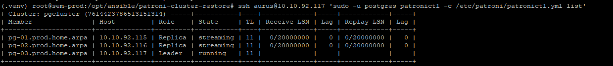
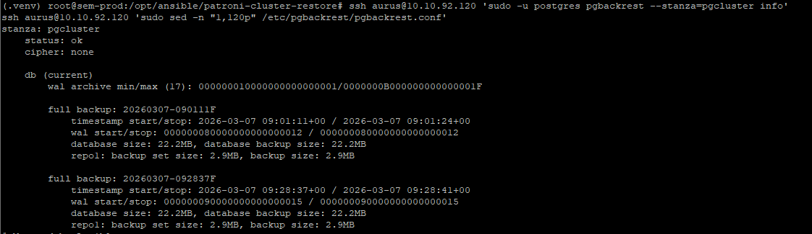
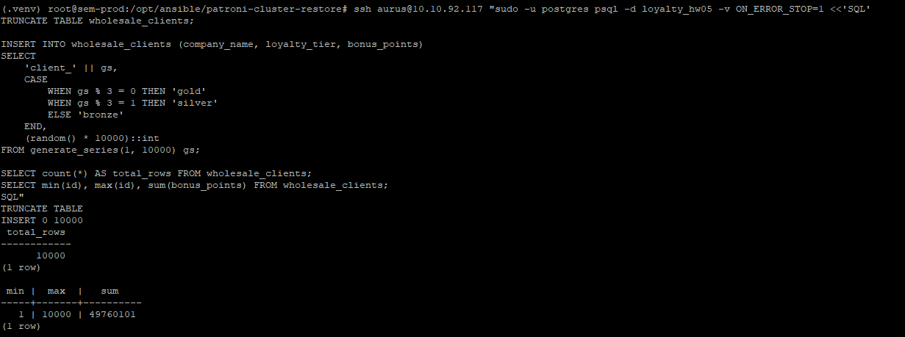
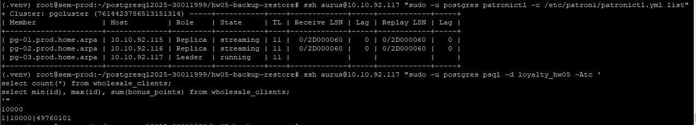
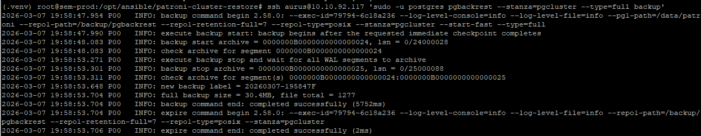
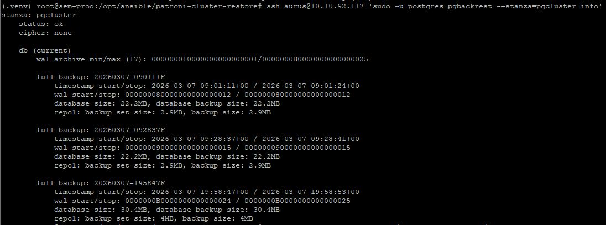
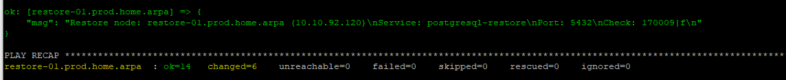
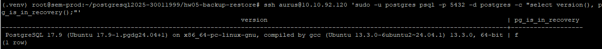
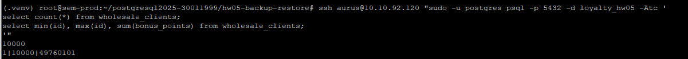
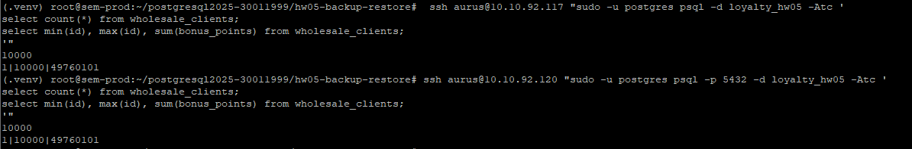

# HW05 — Бэкапы и восстановление PostgreSQL в Patroni-кластере

## Цель

Настроить надёжное резервное копирование PostgreSQL и проверить восстановление данных на отдельном узле вне основного Patroni-кластера.

---

## 1. Исходные условия

В качестве базы использовался уже собранный HA-стенд из HW04:

- 3 ноды `etcd`
- 3 ноды `PostgreSQL + Patroni`
- 1 нода `HAProxy`
- 1 нода `backup-01` для хранения резервных копий
- 1 отдельная нода `restore-01` для проверки восстановления

### Узлы стенда

- `pg-01.prod.home.arpa` — `10.10.92.115`
- `pg-02.prod.home.arpa` — `10.10.92.116`
- `pg-03.prod.home.arpa` — `10.10.92.117`
- `backup-01.prod.home.arpa` — `10.10.92.119`
- `restore-01.prod.home.arpa` — `10.10.92.120`

### Используемые компоненты

- `Patroni`
- `etcd`
- `HAProxy`
- `pgBackRest`
- `NFS`
- `Ansible`

### Параметры

- имя Patroni-кластера: `pgcluster`
- stanza `pgBackRest`: `pgcluster`
- версия PostgreSQL: `17`

---

## 2. Что было сделано

### 2.1 Настроен backup-server

На узле `backup-01` был настроен сервер хранения резервных копий:

- подключён и смонтирован отдельный диск;
- создан каталог репозитория `pgBackRest`;
- каталог экспортирован по `NFS`;
- доступ к хранилищу открыт для лабораторной сети.

Используемый путь хранения:

- репозиторий backup’ов: `/srv/pgbackups`

---

### 2.2 Подготовлен отдельный restore-узел

Для проверки восстановления была создана отдельная VM:

- hostname: `restore-01.prod.home.arpa`
- IP: `10.10.92.120`

Restore-узел **не входит** в Patroni-кластер и используется как standalone PostgreSQL, в который восстанавливается последний backup.

На `restore-01` были выполнены:

- установка PostgreSQL 17;
- установка `pgbackrest`;
- подключение NFS-репозитория;
- настройка отдельного systemd unit `postgresql-restore`;
- подготовка конфигурации для standalone-восстановления.

---

## 3. Проверка состояния Patroni-кластера

Перед началом теста резервного копирования и восстановления было проверено состояние кластера.

Команда:

```bash
ssh aurus@10.10.92.117 'sudo -u postgres patronictl -c /etc/patroni/patronictl.yml list'
```

Проверялось:

- кто сейчас Leader;
- какие ноды работают как Replica;
- в каком состоянии находится кластер.



На скриншоте видно текущее состояние Patroni-кластера и роли узлов.

---

## 4. Проверка репозитория pgBackRest

Перед выполнением нового backup была выполнена проверка репозитория резервных копий.

Команды:

```bash
df -h /backup/pgbackrest
sudo -u postgres pgbackrest --stanza=pgcluster info
```

Проверялось:

- что репозиторий доступен;
- что stanza `pgcluster` существует;
- что в репозитории уже есть backup sets.



На скриншоте видно подключённый backup-репозиторий и список резервных копий.

---

## 5. Создание тестовой базы данных

На лидере Patroni-кластера была создана тестовая база данных:

```sql
CREATE DATABASE loyalty_hw05;
```

Команда:

```bash
ssh aurus@10.10.92.117 'sudo -u postgres psql -v ON_ERROR_STOP=1 <<SQL
CREATE DATABASE loyalty_hw05;
SQL'
```

---

## 6. Создание таблицы и генерация тестовых данных

В тестовой базе была создана таблица:

```sql
CREATE TABLE wholesale_clients (
    id bigserial PRIMARY KEY,
    company_name text NOT NULL,
    loyalty_tier text NOT NULL,
    bonus_points integer NOT NULL,
    created_at timestamptz NOT NULL DEFAULT now()
);
```

После этого таблица была заполнена 10000 строк тестовых данных.

Команда:

```bash
ssh aurus@10.10.92.117 "sudo -u postgres psql -d loyalty_hw05 -v ON_ERROR_STOP=1 <<'SQL'
CREATE TABLE IF NOT EXISTS wholesale_clients (
    id bigserial PRIMARY KEY,
    company_name text NOT NULL,
    loyalty_tier text NOT NULL,
    bonus_points integer NOT NULL,
    created_at timestamptz NOT NULL DEFAULT now()
);

TRUNCATE TABLE wholesale_clients RESTART IDENTITY;

INSERT INTO wholesale_clients (company_name, loyalty_tier, bonus_points)
SELECT
    'client_' || gs,
    CASE
        WHEN gs % 3 = 0 THEN 'gold'
        WHEN gs % 3 = 1 THEN 'silver'
        ELSE 'bronze'
    END,
    (random() * 10000)::int
FROM generate_series(1, 10000) gs;

SELECT count(*) AS total_rows FROM wholesale_clients;
SELECT min(id), max(id), sum(bonus_points) FROM wholesale_clients;
SQL"
```



На скриншоте видно успешную генерацию тестовых данных и контрольные значения после вставки.

---

## 7. Контрольный запрос на лидере

Перед созданием нового backup были зафиксированы контрольные значения на лидере.

Команда:

```bash
ssh aurus@10.10.92.117 "sudo -u postgres psql -d loyalty_hw05 -Atc '
select count(*) from wholesale_clients;
select min(id), max(id), sum(bonus_points) from wholesale_clients;
'"
```

Результат:

```text
10000
1|10000|49760101
```



На скриншоте видно контрольные значения, с которыми далее сравнивались данные после восстановления.

---

## 8. Создание нового full backup

После генерации тестовых данных был выполнен новый полный backup на лидере `pg-03`.

Команда:

```bash
ssh aurus@10.10.92.117 'sudo -u postgres pgbackrest --stanza=pgcluster --type=full backup'
```

Результат:

- создан новый backup label: `20260307-195847F`



На скриншоте видно успешное завершение команды `pgbackrest backup`.

---

## 9. Повторная проверка репозитория после backup

После создания нового backup было дополнительно проверено содержимое репозитория.

Команда:

```bash
ssh aurus@10.10.92.117 'sudo -u postgres pgbackrest --stanza=pgcluster info'
```

Проверялось:

- что новый full backup действительно появился;
- что stanza остаётся в состоянии `ok`.



На скриншоте видно, что в репозитории появился новый backup `20260307-195847F`.

---

## 10. Восстановление backup на restore-узел

Для проверки сценария восстановления был использован отдельный Ansible playbook:

```bash
ansible-playbook -i inventory/hosts.yml playbooks/restore_pgbackrest.yml
```

В ходе выполнения playbook:

- останавливался standalone PostgreSQL на `restore-01`;
- удалялся старый data directory;
- выполнялось восстановление последнего backup;
- поднимался standalone сервис `postgresql-restore`.



На скриншоте видно успешное выполнение `restore_pgbackrest.yml` без ошибок.

---

## 11. Проверка состояния PostgreSQL после восстановления

После завершения playbook была проверена работа standalone PostgreSQL на `restore-01`.

Команда:

```bash
ssh aurus@10.10.92.120 'sudo -u postgres psql -p 5432 -d postgres -c "select version(), pg_is_in_recovery();"'
```

Ожидалось:

- PostgreSQL доступен;
- `pg_is_in_recovery() = false`.



На скриншоте видно, что восстановленный экземпляр успешно поднялся и работает как standalone PostgreSQL.

---

## 12. Контрольный запрос на restore-узле

После восстановления были выполнены те же контрольные запросы, что и на лидере.

Команда:

```bash
ssh aurus@10.10.92.120 "sudo -u postgres psql -p 5432 -d loyalty_hw05 -Atc '
select count(*) from wholesale_clients;
select min(id), max(id), sum(bonus_points) from wholesale_clients;
'"
```

Результат:

```text
10000
1|10000|49760101
```



На скриншоте видно, что после восстановления данные доступны и контрольные значения совпадают.

---

## 13. Сравнение данных на лидере и на restore-узле

Итоговая сверка показала:

### На лидере

```text
10000
1|10000|49760101
```

### На restore-узле

```text
10000
1|10000|49760101
```



На скриншоте видно полное совпадение результатов контрольных запросов на основном узле и на restore-узле.

---

## 14. Проблемы и как они решались

### 14.1 PostgreSQL 17 отсутствовал в стандартных репозиториях

На restore-узле пакет `postgresql-17` отсутствовал в стандартных репозиториях ОС.

Решение:

- был добавлен официальный `PGDG`-репозиторий PostgreSQL;
- после этого установка PostgreSQL 17 и `pgbackrest` прошла успешно.

---

### 14.2 Были проблемы с NFS-доступом к backup-репозиторию

Изначально `restore-01` не мог смонтировать репозиторий резервных копий по NFS.

Причина:

- экспорт был настроен недостаточно широко для restore-узла.

Решение:

- был скорректирован шаблон `exports`;
- доступ был открыт для лабораторной подсети `10.10.92.0/24`.

---

### 14.3 Попытка запуска backup с реплики не сработала в текущей конфигурации

Проверялась команда:

```bash
ssh aurus@10.10.92.116 'sudo -u postgres pgbackrest --stanza=pgcluster --type=full backup'
```

Результат:

```text
ERROR: [056]: unable to find primary cluster - cannot proceed
HINT: are all available clusters in recovery?
```

Вывод:

- текущая конфигурация `pgBackRest` ориентирована на backup с primary;
- полноценный сценарий `backup-from-standby` требует отдельной настройки:
  - `backup-standby`
  - корректного описания `primary/standby`
  - дополнительной проверки связности

Так как этот пункт в задании обозначен как **дополнительный**, основной сценарий HW05 считается выполненным.

---

## 15. Итог

В рамках HW05 был реализован и проверен полный сценарий резервного копирования и восстановления PostgreSQL:

- настроено резервное копирование через `pgBackRest`;
- подготовлен отдельный restore-узел `restore-01`;
- выполнено восстановление последнего full backup;
- поднят standalone PostgreSQL после восстановления;
- корректность восстановленных данных подтверждена контрольными SQL-запросами.

### Финальный вывод

Резервное копирование и восстановление работают корректно.  
Сценарий восстановления на отдельный узел успешно проверен.

---

## 16. Приложение

К отчёту приложена ansible-автоматизация, использованная для выполнения HW05.

В составе сдачи:

- playbooks для настройки `backup-server`;
- playbooks для настройки `restore-node`;
- playbook восстановления `restore_pgbackrest.yml`;
- inventory, роли и шаблоны `Ansible`;
- архив с ansible-проектом:
  - `hw05-pgbackrest-restore-ansible.tgz`

---

## 17. Как воспроизвести

Ниже приведён сценарий, по которому проверяющий может скачать проект, подготовить ansible-окружение и повторить восстановление на своём хосте.

### 17.1 Получить проект

Есть два варианта.

#### Вариант A. Клонировать git-репозиторий

```bash
git clone <URL_ВАШЕГО_РЕПОЗИТОРИЯ>
cd postgresql2025-30011999/hw05-backup-restore
```

Если ansible-проект лежит в подпапке `ansible`, перейти в неё:

```bash
cd ansible
```

#### Вариант B. Скачать архив из репозитория

Если ansible-проект приложен отдельным архивом, его можно распаковать так:

```bash
mkdir -p /opt/ansible/patroni-cluster-restore
cd /opt/ansible/patroni-cluster-restore
tar -xzf /path/to/hw05-pgbackrest-restore-ansible.tgz
```

После распаковки внутри каталога должны появиться:

- `ansible.cfg`
- `inventory/`
- `playbooks/`
- `roles/`
- `requirements.txt`
- `requirements.yml`
- `bootstrap.sh`

Если используется распакованный архив, то дальше работать нужно из каталога, куда он был распакован.

---

### 17.2 Подготовить `env.sh`

Нужно создать файл `env.sh` на основе `env.example.sh` или вручную.

Пример:

```bash
cp env.example.sh env.sh
```

После этого в `env.sh` нужно указать свои переменные окружения:

```bash
export PROXMOX_API_HOST='pve01.example.local'
export PROXMOX_API_USER='ansible@pve'
export PROXMOX_API_TOKEN_ID='tokenid'
export PROXMOX_API_TOKEN_SECRET='tokensecret'

export PROXMOX_NODE='pve-node'
export PROXMOX_STORAGE='local-lvm'
export PROXMOX_TEMPLATE_ID='9100'

export DNS_SERVER='10.10.92.53'
export SEARCH_DOMAIN='prod.home.arpa'

export CI_USER='aurus'
export CI_PASSWORD='your-password'
export CLOUD_INIT_SSH_PUBLIC_KEY="$(cat ~/.ssh/id_ed25519.pub)"
export BACKUP_DISK_SIZE_GB='200'
```

> `env.sh` содержит чувствительные данные и не должен попадать в git.

---

### 17.3 Подготовить виртуальное окружение Python и зависимости

Если `.venv` ещё не существует:

```bash
python3 -m venv .venv
```

Активировать окружение:

```bash
source .venv/bin/activate
```

Установить зависимости можно двумя способами.

#### Вариант A. Через `bootstrap.sh`

```bash
./bootstrap.sh
```

#### Вариант B. Вручную

```bash
pip install -r requirements.txt
ansible-galaxy install -r requirements.yml
```

---

### 17.4 Загрузить переменные окружения

```bash
source ./env.sh
```

---

### 17.5 Подготовить restore-узел

Если restore-VM ещё не создана, используется такой запуск:

```bash
ansible-playbook -i inventory/hosts.yml playbooks/site_restore.yml   -e provision_vms=false   -e provision_backup_vm=false   -e provision_restore_vm=true
```

Что делает этот playbook:

- добавляет/настраивает restore-VM;
- обновляет `backup-01`;
- настраивает NFS-доступ;
- устанавливает PostgreSQL и `pgBackRest` на restore-узел;
- подготавливает standalone systemd unit.

---

### 17.6 Повторная настройка уже существующего restore-узла

Если restore-VM уже создана и нужно просто повторно применить конфигурацию:

```bash
ansible-playbook -i inventory/hosts.yml playbooks/site_restore.yml   -e provision_vms=false   -e provision_backup_vm=false   -e provision_restore_vm=false
```

---

### 17.7 Создать новый backup

На лидере Patroni-кластера:

```bash
ssh aurus@10.10.92.117 'sudo -u postgres pgbackrest --stanza=pgcluster --type=full backup'
```

Проверить, что backup появился:

```bash
ssh aurus@10.10.92.117 'sudo -u postgres pgbackrest --stanza=pgcluster info'
```

---

### 17.8 Выполнить восстановление

После того как backup уже существует, восстановление запускается так:

```bash
ansible-playbook -i inventory/hosts.yml playbooks/restore_pgbackrest.yml
```

---

### 17.9 Проверить восстановленный PostgreSQL

```bash
ssh aurus@10.10.92.120 'sudo -u postgres psql -p 5432 -d postgres -c "select version(), pg_is_in_recovery();"'
```

Ожидается:

- PostgreSQL отвечает;
- `pg_is_in_recovery() = false`.

---

### 17.10 Проверить восстановленные данные

```bash
ssh aurus@10.10.92.120 "sudo -u postgres psql -p 5432 -d loyalty_hw05 -Atc '
select count(*) from wholesale_clients;
select min(id), max(id), sum(bonus_points) from wholesale_clients;
'"
```
