# HW06 — Гонка за производительностью PostgreSQL

## Цель

Развернуть отдельный инстанс PostgreSQL, измерить производительность с помощью `pgbench`, провести тюнинг параметров сервера и сравнить результаты до и после оптимизации.

---

## 1. Исходные условия и стенд

Для HW06 был выбран отдельный standalone-инстанс PostgreSQL, без Patroni и без репликации.  
Такой вариант удобен для чистых измерений, потому что на результат не влияют HA-компоненты и фоновые процессы отказоустойчивого кластера.

### Конфигурация стенда

Использовалась отдельная VM:

- hostname: `pgperf-01.prod.home.arpa`
- IP: `10.10.92.121`
- ОС: Ubuntu 24.04
- PostgreSQL: `17.9`
- инструмент нагрузки: `pgbench`

В ходе работы было выполнено несколько этапов:

1. baseline на VM `4 vCPU / 4 GB RAM`;
2. exploratory run с unsafe tuning;
3. увеличение ресурсов VM до `8 vCPU / 32 GB RAM`;
4. baseline на новом железе;
5. safe tuning без отключения durability-параметров;
6. эксперимент с `THP`;
7. эксперимент с `explicit huge pages`;
8. финальный HDD-friendly tuned profile.

---

## 2. Развёртывание отдельной VM под тест

Для HW06 использовался отдельный ansible-проект, который:

- создаёт VM `pgperf-01` в Proxmox;
- устанавливает PostgreSQL 17 и `pgbench`;
- применяет baseline / tuned profile;
- подготавливает тестовую БД `pgbench`;
- запускает нагрузочный тест и сохраняет результаты.

Основные playbooks:

- `playbooks/create_perf_vm.yml`
- `playbooks/configure_perf_vm.yml`
- `playbooks/apply_baseline.yml`
- `playbooks/apply_tuned.yml`
- `playbooks/prepare_pgbench.yml`
- `playbooks/run_pgbench.yml`

### Пример запуска

```bash
cd ansible
cp env.example.sh env.sh
vim env.sh

python3 -m venv .venv
source .venv/bin/activate
./bootstrap.sh
source ./env.sh

ansible-playbook -i inventory/hosts.yml playbooks/create_perf_vm.yml
ansible-playbook -i inventory/hosts.yml playbooks/configure_perf_vm.yml
```

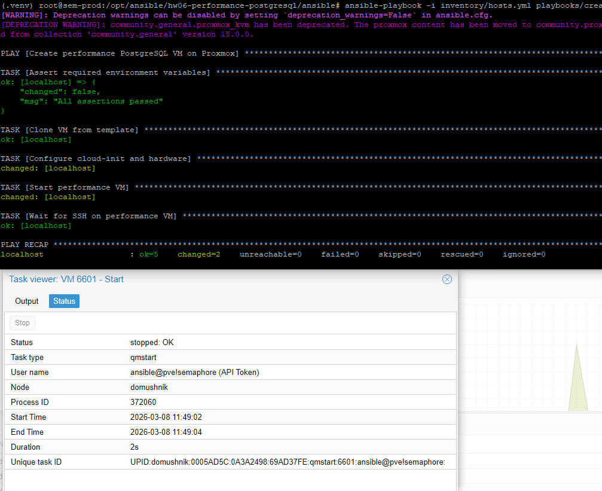

На скриншоте видно, что VM поднята, PostgreSQL установлен и сервер доступен.

---

## 3. Проверка версии PostgreSQL и pgbench

После настройки VM была выполнена проверка установленных версий:

```bash
ssh aurus@10.10.92.121 'psql --version'
ssh aurus@10.10.92.121 'pgbench --version'
ssh aurus@10.10.92.121 'sudo systemctl status postgresql@17-main --no-pager'
```

Результат:

- `psql (PostgreSQL) 17.9`
- `pgbench (PostgreSQL) 17.9`

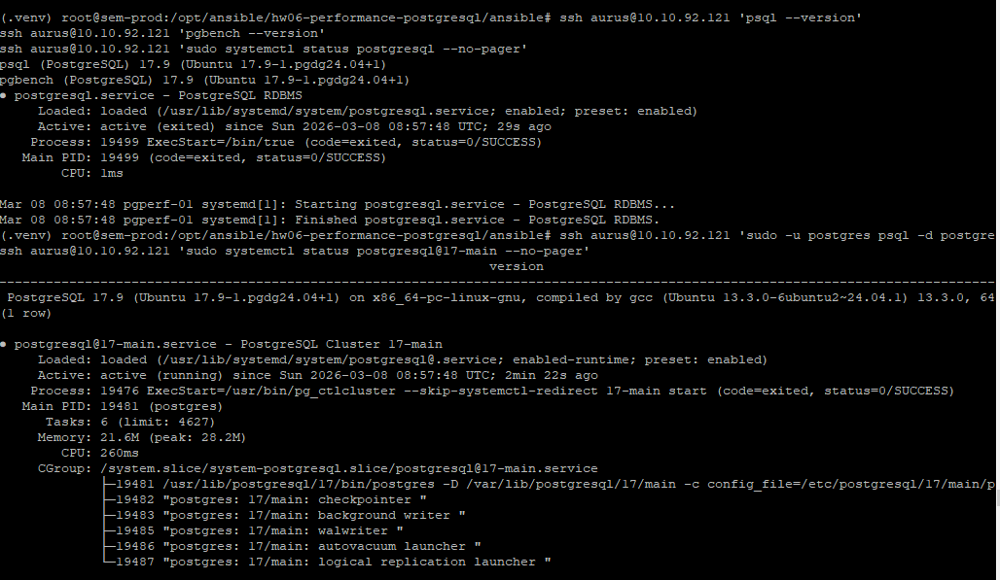

На скриншоте видно, что PostgreSQL 17.9 установлен и кластер `17-main` работает.

---

## 4. Подготовка тестовой БД pgbench

Для всех прогонов использовалась стандартная база `pgbench` со scale factor `100`.

Команда:

```bash
ansible-playbook -i inventory/hosts.yml playbooks/prepare_pgbench.yml
```

Внутри playbook происходило:

- удаление старой БД `pgbench`;
- создание новой БД `pgbench`;
- инициализация данных командой:

```bash
sudo -u postgres pgbench -i -s 100 pgbench
```

---

## 5. Baseline на исходной VM (4 vCPU / 4 GB RAM)

На первой конфигурации VM был выполнен baseline-тест:

- clients: `20`
- jobs: `4`
- time: `60 s`
- mode: `prepared`

Фактически использовалась команда:

```bash
sudo -u postgres pgbench -c 20 -j 4 -T 60 -M prepared pgbench
```

### Результат baseline (4 CPU / 4 GB)

- TPS: `1402.857433`
- latency avg: `14.257 ms`

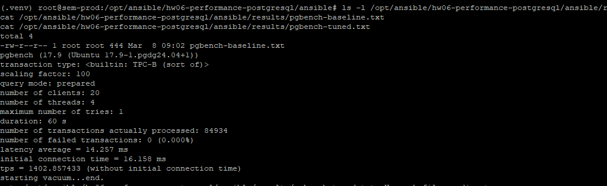

На скриншоте видно baseline-результат до тюнинга.

---

## 6. Exploratory run с unsafe tuning

Так как в формулировке задания допускается настройка на максимальную производительность без оглядки на стабильность, был выполнен отдельный exploratory run с небезопасными параметрами.

Использовались настройки:

- `fsync = off`
- `synchronous_commit = off`
- `full_page_writes = off`
- `autovacuum = off`

### Результат unsafe tuning (4 CPU / 4 GB)

- TPS: `6944.033582`
- latency avg: `2.880 ms`

По сравнению с baseline на той же VM:

- прирост TPS: **+394.99%**
- снижение latency: **-79.80%**

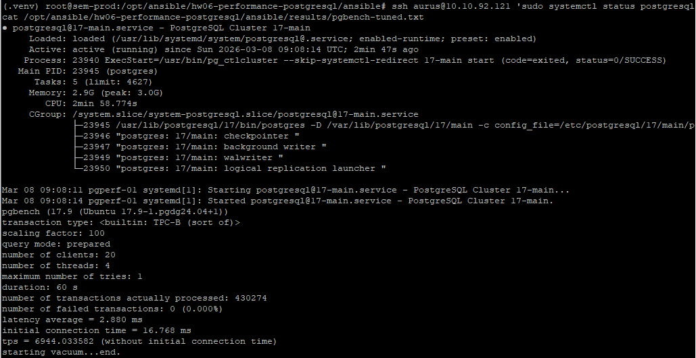

Этот эксперимент подтвердил, что отключение durability-параметров резко повышает throughput, но такой профиль нельзя считать production-friendly.

---

## 7. Переход к более практичному сценарию

После exploratory run было решено перейти к более реалистичному варианту:

- увеличить ресурсы VM до `8 vCPU / 32 GB RAM`;
- не отключать durability-параметры;
- не отключать `autovacuum`;
- строить конфигурацию так, как если бы это был production-like сценарий.


На скриншоте видно, что VM была переведена на более мощную конфигурацию.

---

## 8. Baseline на 8 vCPU / 32 GB RAM

После увеличения ресурсов был снова выполнен baseline с теми же параметрами нагрузки:

- clients: `20`
- jobs: `4`
- time: `60 s`
- mode: `prepared`

### Результат baseline (8 CPU / 32 GB)

- TPS: `1596.568426`
- latency avg: `12.527 ms`

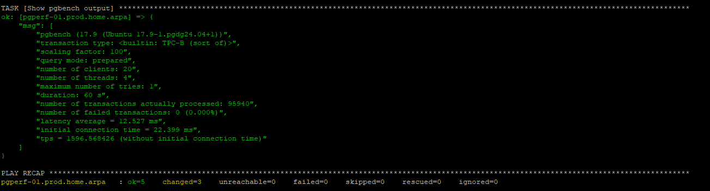

По сравнению с baseline `4 CPU / 4 GB`:

- прирост TPS: **+13.81%**
- снижение latency: **-12.13%**

Вывод: простое увеличение ресурсов помогло, но не радикально. Основной выигрыш ожидался именно от тюнинга PostgreSQL.

---

## 9. Safe tuned profile (production-like)

Для основного tuned-профиля были выбраны безопасные параметры, сохраняющие durability:

- `fsync = on`
- `synchronous_commit = on`
- `full_page_writes = on`
- `autovacuum = on`

При этом были оптимизированы:

```conf
shared_buffers = 8GB
effective_cache_size = 24GB
work_mem = 32MB
maintenance_work_mem = 2GB

checkpoint_timeout = 30min
checkpoint_completion_target = 0.9
max_wal_size = 16GB
min_wal_size = 4GB
wal_buffers = -1

random_page_cost = 1.1
effective_io_concurrency = 256

max_worker_processes = 16
max_parallel_workers = 8
max_parallel_workers_per_gather = 4
max_parallel_maintenance_workers = 4

autovacuum = on
autovacuum_max_workers = 5
autovacuum_naptime = 10s
autovacuum_vacuum_cost_limit = 2000

bgwriter_delay = 50ms
bgwriter_lru_maxpages = 1000
bgwriter_lru_multiplier = 4.0

jit = off
huge_pages = try
```

Проверка параметров:

```bash
ssh aurus@10.10.92.121 'sudo -u postgres psql -Atc "
show shared_buffers;
show effective_cache_size;
show work_mem;
show maintenance_work_mem;
show fsync;
show synchronous_commit;
show full_page_writes;
show autovacuum;
show max_parallel_workers;
show max_wal_size;
"'
```

Результат:

- `shared_buffers = 8GB`
- `effective_cache_size = 24GB`
- `work_mem = 32MB`
- `maintenance_work_mem = 2GB`
- `fsync = on`
- `synchronous_commit = on`
- `full_page_writes = on`
- `autovacuum = on`
- `max_parallel_workers = 8`
- `max_wal_size = 16GB`

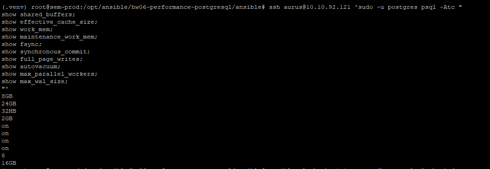

На скриншоте видно, что tuned-профиль применён и durability-параметры сохранены.

---

## 10. Результат safe tuned profile

После применения safe tuned profile был снова выполнен тот же `pgbench`.

### Результат safe tuned (8 CPU / 32 GB)

- TPS: `11569.005249`
- latency avg: `1.729 ms`

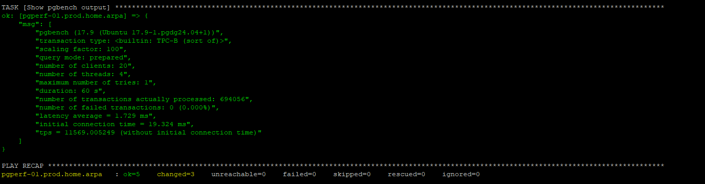

По сравнению с baseline на том же железе:

- прирост TPS: **+624.62%**
- снижение latency: **-86.20%**

Это уже дало кратный рост производительности без отключения durability.

---

## 11. Эксперимент с Transparent Huge Pages (THP)

Далее было проверено влияние `Transparent Huge Pages`.

### Проверка исходного состояния

Команды:

```bash
ssh aurus@10.10.92.121 'sudo -u postgres psql -Atc "
show huge_pages;
show huge_pages_status;
show shared_memory_size;
show shared_memory_size_in_huge_pages;
"'

ssh aurus@10.10.92.121 'cat /sys/kernel/mm/transparent_hugepage/enabled'
ssh aurus@10.10.92.121 'test -f /sys/kernel/mm/transparent_hugepage/defrag && cat /sys/kernel/mm/transparent_hugepage/defrag || true'
```

Результат:

- `huge_pages = try`
- `huge_pages_status = off`
- `shared_memory_size = 8436MB`
- `shared_memory_size_in_huge_pages = 4218`

То есть PostgreSQL пытался использовать huge pages, но фактически работал без них.

После этого THP были отключены:

```bash
ssh aurus@10.10.92.121 'echo never | sudo tee /sys/kernel/mm/transparent_hugepage/enabled'
ssh aurus@10.10.92.121 'test -f /sys/kernel/mm/transparent_hugepage/defrag && echo never | sudo tee /sys/kernel/mm/transparent_hugepage/defrag || true'
ssh aurus@10.10.92.121 'sudo systemctl restart postgresql@17-main'
```

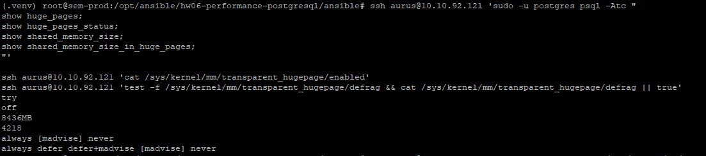

На скриншоте видно, что THP переведены в режим `never`.

### Результат safe tuned + THP off

- TPS: `11803.896308`
- latency avg: `1.694 ms`

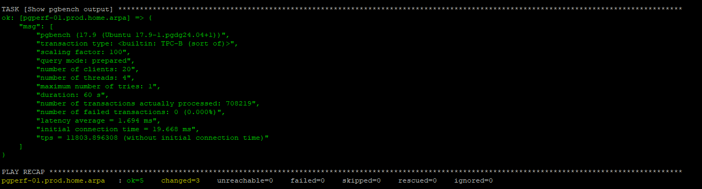

По сравнению с предыдущим safe tuned:

- прирост TPS: **+2.03%**
- снижение latency: **-2.02%**

Вывод: отключение THP дало небольшой, но положительный эффект.

---

## 12. Эксперимент с explicit huge pages

Так как `huge_pages = try` не приводил к реальному использованию huge pages (`huge_pages_status = off`), был выполнен отдельный эксперимент с явным резервированием huge pages в ОС.

### Резервирование huge pages

На основе значения:

- `shared_memory_size_in_huge_pages = 4218`

в ОС было зарезервировано `4352` huge pages:

```bash
ssh aurus@10.10.92.121 "echo 'vm.nr_hugepages=4352' | sudo tee /etc/sysctl.d/99-postgres-hugepages.conf >/dev/null"
ssh aurus@10.10.92.121 'sudo sysctl --system'
ssh aurus@10.10.92.121 'cat /proc/sys/vm/nr_hugepages'
```

После этого в tuned-профиле параметр был переведён в режим:

```conf
huge_pages = on
```

Проверка:

```bash
ssh aurus@10.10.92.121 'sudo -u postgres psql -Atc "
show huge_pages;
show huge_pages_status;
show shared_memory_size_in_huge_pages;
"'
```

Результат:

- `huge_pages = on`
- `huge_pages_status = on`
- `shared_memory_size_in_huge_pages = 4218`

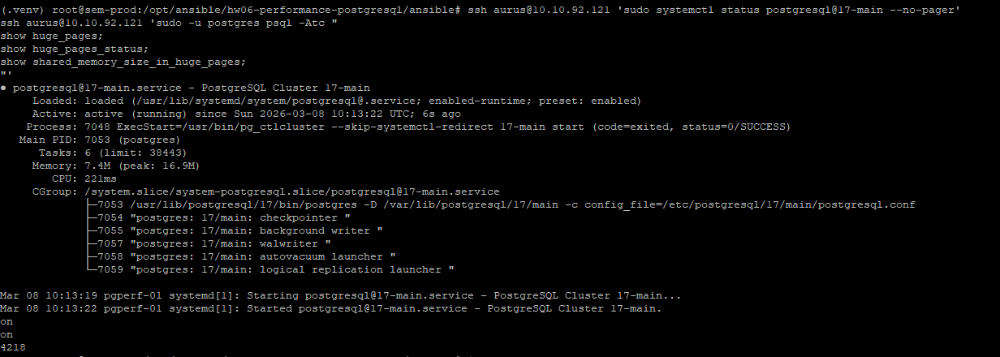

На скриншоте видно, что PostgreSQL действительно стартовал с explicit huge pages.

### Результат safe tuned + THP off + huge_pages=on

- TPS: `11907.882892`
- latency avg: `1.680 ms`


По сравнению с вариантом `THP off`:

- прирост TPS: **+0.88%**
- снижение latency: **-0.83%**

Вывод: explicit huge pages дали ещё небольшой дополнительный выигрыш.

---

## 13. Финальная корректировка профиля под HDD

После этого был выполнен ещё один этап: скорректировать tuned-профиль с учётом того, что storage у стенда — HDD.

Изначально использовались значения, больше похожие на SSD/NVMe-профиль:

- `random_page_cost = 1.1`
- `effective_io_concurrency = 256`

Для более честного production-like профиля под HDD они были изменены на:

- `random_page_cost = 3.0`
- `effective_io_concurrency = 8`
- `maintenance_io_concurrency = 8`

Остальные безопасные параметры были сохранены:

- `fsync = on`
- `synchronous_commit = on`
- `full_page_writes = on`
- `autovacuum = on`
- `THP = never`
- `huge_pages = on`

Проверка:

```bash
ssh aurus@10.10.92.121 'sudo -u postgres psql -Atc "
show random_page_cost;
show effective_io_concurrency;
show maintenance_io_concurrency;
show huge_pages;
show huge_pages_status;
show fsync;
show synchronous_commit;
show full_page_writes;
show autovacuum;
"'
```

Результат:

- `random_page_cost = 3`
- `effective_io_concurrency = 8`
- `maintenance_io_concurrency = 8`
- `huge_pages = on`
- `huge_pages_status = on`
- `fsync = on`
- `synchronous_commit = on`
- `full_page_writes = on`
- `autovacuum = on`


### Результат HDD-friendly tuned profile

- TPS: `12508.761074`
- latency avg: `1.599 ms`

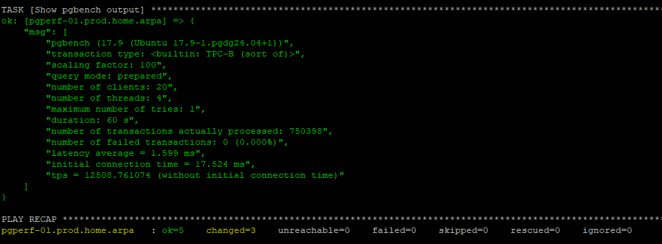

По сравнению с предыдущим safe tuned + THP off + huge_pages=on:

- прирост TPS: **+5.05%**
- снижение latency: **-4.82%**

По сравнению с baseline `8 CPU / 32 GB`:

- рост TPS: **+683.48%**
- снижение latency: **-87.24%**

Именно этот вариант стал лучшим безопасным итоговым профилем.

---

## 14. Дополнительный stress test

В качестве дополнительного эксперимента был выполнен более тяжёлый прогон:

- clients: `64`
- jobs: `8`

Команда:

```bash
ansible-playbook -i inventory/hosts.yml playbooks/run_pgbench.yml   -e pgbench_run_label=tuned_safe_heavy   -e pgbench_clients=64   -e pgbench_jobs=8
```

### Результат heavy test

- TPS: `13513.892273`
- latency avg: `4.736 ms`

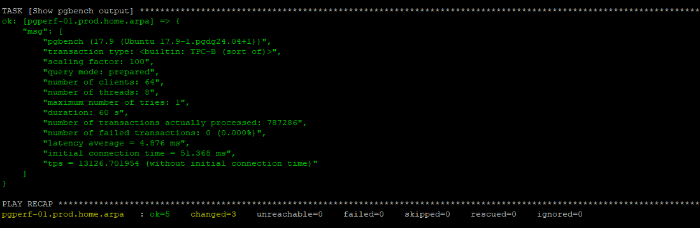

Этот прогон показал, что throughput при более высокой конкуренции вырос ещё сильнее, но увеличилась средняя задержка, что ожидаемо.

---

## 15. Сводная таблица результатов

### Основные прогоны

| Сценарий | VM | Профиль | TPS | Avg latency |
|---|---|---|---:|---:|
| Baseline | 4 CPU / 4 GB | defaults | 1402.857433 | 14.257 ms |
| Unsafe tuned | 4 CPU / 4 GB | durability off | 6944.033582 | 2.880 ms |
| Baseline | 8 CPU / 32 GB | defaults | 1596.568426 | 12.527 ms |
| Tuned safe | 8 CPU / 32 GB | durability on | 11569.005249 | 1.729 ms |
| Tuned safe + THP off | 8 CPU / 32 GB | durability on | 11803.896308 | 1.694 ms |
| Tuned safe + THP off + huge_pages=on | 8 CPU / 32 GB | durability on | 11907.882892 | 1.680 ms |
| HDD-friendly tuned safe | 8 CPU / 32 GB | durability on | **12508.761074** | **1.599 ms** |

### Дополнительный heavy test

| Сценарий | clients | jobs | TPS | Avg latency |
|---|---:|---:|---:|---:|
| Tuned safe heavy | 64 | 8 | 13513.892273 | 4.736 ms |

---

## 16. Основные выводы

### 16.1 Агрессивный unsafe tuning действительно даёт сильный прирост

На исходной VM `4 CPU / 4 GB` unsafe-профиль увеличил TPS:

- с `1402.857` до `6944.034`
- прирост: **+394.99%**

Но такой режим достигнут ценой отключения durability и не подходит для production.

### 16.2 Простое увеличение ресурсов само по себе помогает, но не радикально

Переход с baseline `4 CPU / 4 GB` на baseline `8 CPU / 32 GB` дал:

- TPS: `1402.857 -> 1596.568`
- прирост: **+13.81%**

То есть основная выгода была достигнута не только железом, а именно тюнингом PostgreSQL.

### 16.3 Безопасный тюнинг дал основной практический результат

На `8 CPU / 32 GB` safe tuned profile дал:

- TPS: `1596.568 -> 11569.005`
- прирост: **+624.62%**
- latency: `12.527 ms -> 1.729 ms`
- снижение: **-86.20%**

### 16.4 Отключение THP и включение explicit huge pages дали дополнительный выигрыш

- `THP off` дал ещё **+2.03% TPS**
- `huge_pages = on` дал ещё **+0.88% TPS**

### 16.5 HDD-friendly профиль оказался лучшим безопасным итоговым вариантом

После корректировки planner / IO параметров под HDD:

- TPS: `11907.883 -> 12508.761`
- прирост: **+5.05%**
- latency: `1.680 ms -> 1.599 ms`
- снижение: **-4.82%**

### 16.6 Лучший production-like результат

Лучший безопасный вариант:

- `8 CPU / 32 GB`
- HDD-friendly tuned profile
- `THP = never`
- `huge_pages = on`
- `fsync = on`
- `synchronous_commit = on`
- `full_page_writes = on`
- `autovacuum = on`

Его результат:

- TPS: `12508.761074`
- latency avg: `1.599 ms`

По сравнению с baseline `8 CPU / 32 GB`:

- рост TPS: **+683.48%**
- снижение latency: **-87.24%**

Итоговая производительность выросла примерно в **7.83 раза**.

---

## 17. Финальный вывод

В рамках HW06 удалось провести несколько последовательных этапов оптимизации PostgreSQL и получить сильный прирост производительности под нагрузкой.

Главные итоги:

- baseline на стандартных настройках показал сравнительно низкий throughput;
- unsafe tuning дал очень большой прирост, но ценой отключения гарантий сохранности данных;
- переход к более мощной VM и безопасному tuned-профилю позволил получить конфигурацию с кратным ростом производительности;
- дополнительная настройка памяти на уровне ОС (`THP off`, `huge_pages = on`) дала ещё небольшой прирост;
- финальная корректировка planner / IO параметров под HDD улучшила результат ещё сильнее.

### Итоговая лучшая конфигурация

Наилучший баланс между производительностью и надёжностью был достигнут в конфигурации:

- `8 vCPU / 32 GB RAM`
- `shared_buffers = 8GB`
- `effective_cache_size = 24GB`
- `work_mem = 32MB`
- `maintenance_work_mem = 2GB`
- `checkpoint_timeout = 30min`
- `checkpoint_completion_target = 0.9`
- `max_wal_size = 16GB`
- `min_wal_size = 4GB`
- `random_page_cost = 3.0`
- `effective_io_concurrency = 8`
- `maintenance_io_concurrency = 8`
- `max_parallel_workers = 8`
- `max_parallel_workers_per_gather = 4`
- `autovacuum = on`
- `fsync = on`
- `synchronous_commit = on`
- `full_page_writes = on`
- `THP = never`
- `huge_pages = on`

### Главный практический результат

Даже без отключения durability-параметров удалось увеличить производительность примерно в **7.8 раза** относительно baseline на том же железе.

---

## 18. Как воспроизвести

### 18.1 Подготовить проект

```bash
cd ansible
cp env.example.sh env.sh
vim env.sh

python3 -m venv .venv
source .venv/bin/activate
./bootstrap.sh
source ./env.sh
```

### 18.2 Создать и настроить VM

```bash
ansible-playbook -i inventory/hosts.yml playbooks/create_perf_vm.yml
ansible-playbook -i inventory/hosts.yml playbooks/configure_perf_vm.yml
```

### 18.3 Baseline

```bash
ansible-playbook -i inventory/hosts.yml playbooks/apply_baseline.yml
ansible-playbook -i inventory/hosts.yml playbooks/prepare_pgbench.yml
ansible-playbook -i inventory/hosts.yml playbooks/run_pgbench.yml -e pgbench_run_label=baseline_8cpu_32gb
```

### 18.4 Safe tuned

```bash
ansible-playbook -i inventory/hosts.yml playbooks/apply_tuned.yml
ansible-playbook -i inventory/hosts.yml playbooks/prepare_pgbench.yml
ansible-playbook -i inventory/hosts.yml playbooks/run_pgbench.yml -e pgbench_run_label=tuned_safe_8cpu_32gb
```

### 18.5 THP off

```bash
ssh aurus@10.10.92.121 'echo never | sudo tee /sys/kernel/mm/transparent_hugepage/enabled'
ssh aurus@10.10.92.121 'test -f /sys/kernel/mm/transparent_hugepage/defrag && echo never | sudo tee /sys/kernel/mm/transparent_hugepage/defrag || true'
ssh aurus@10.10.92.121 'sudo systemctl restart postgresql@17-main'

ansible-playbook -i inventory/hosts.yml playbooks/prepare_pgbench.yml
ansible-playbook -i inventory/hosts.yml playbooks/run_pgbench.yml -e pgbench_run_label=tuned_safe_8cpu_32gb_thp_off
```

### 18.6 Explicit huge pages

```bash
ssh aurus@10.10.92.121 "echo 'vm.nr_hugepages=4352' | sudo tee /etc/sysctl.d/99-postgres-hugepages.conf >/dev/null"
ssh aurus@10.10.92.121 'sudo sysctl --system'

# затем huge_pages = on в tuned profile
ansible-playbook -i inventory/hosts.yml playbooks/apply_tuned.yml

ansible-playbook -i inventory/hosts.yml playbooks/prepare_pgbench.yml
ansible-playbook -i inventory/hosts.yml playbooks/run_pgbench.yml -e pgbench_run_label=tuned_safe_8cpu_32gb_hugepages_on
```

### 18.7 HDD-friendly tuned profile

```bash
ansible-playbook -i inventory/hosts.yml playbooks/apply_tuned.yml
ansible-playbook -i inventory/hosts.yml playbooks/prepare_pgbench.yml
ansible-playbook -i inventory/hosts.yml playbooks/run_pgbench.yml -e pgbench_run_label=tuned_safe_hdd_8cpu_32gb
```
