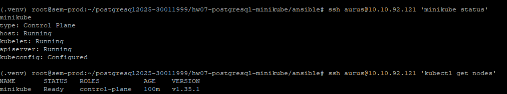
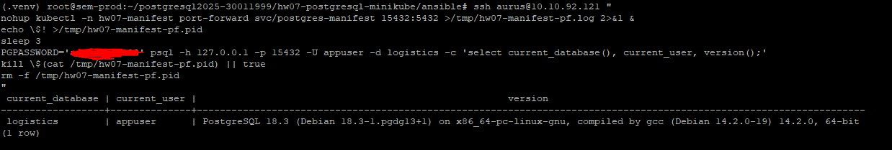
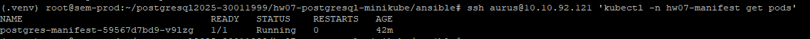
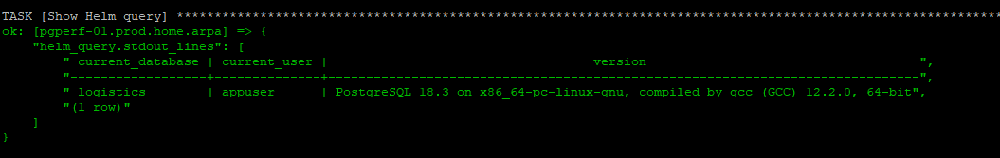
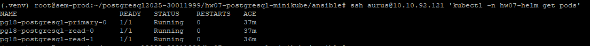
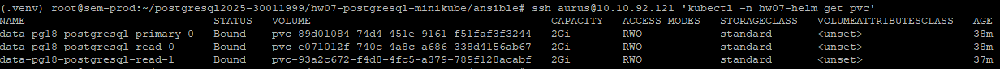

# HW07 — PostgreSQL в Minikube

## Цель

Развернуть PostgreSQL в локальном Kubernetes-кластере Minikube, проверить подключение к базе данных, а также отработать развертывание через манифесты и через Helm с масштабированием до 3 pod'ов.

---

## 1. Исходные условия

Для выполнения задания использовалась уже существующая виртуальная машина из HW06:

- `pgperf-01.prod.home.arpa`
- IP: `10.10.92.121`
- CPU: `8 vCPU`
- RAM: `32 GB`
- Disk: `40 GB`

На этой VM был развернут локальный Kubernetes-кластер `Minikube`.

---

## 2. Что требовалось по заданию

В рамках задания нужно было:

- установить и запустить `Minikube`;
- развернуть PostgreSQL через Kubernetes-манифест;
- проверить подключение к PostgreSQL через `kubectl port-forward + psql`;
- развернуть PostgreSQL через `Helm`;
- масштабировать PostgreSQL до 3 pod'ов;
- убедиться, что все pod'ы находятся в статусе `Running`.

---

## 3. Использованные компоненты

В работе использовались:

- `Docker`
- `Minikube`
- `kubectl`
- `Helm`
- `PostgreSQL`
- `Kubernetes Secret`
- `Kubernetes ConfigMap`
- `PersistentVolumeClaim`
- `Deployment`
- `StatefulSet`

---

## 4. Подготовка окружения

Сначала на существующую VM были установлены необходимые компоненты:

- Docker
- kubectl
- Minikube
- Helm

После этого был запущен Minikube с Docker driver.

Проверка состояния Minikube:

```bash
ssh aurus@10.10.92.121 'minikube status'
ssh aurus@10.10.92.121 'kubectl get nodes'
```

На момент проверки Minikube был успешно поднят, а Kubernetes-нода находилась в статусе `Ready`.



---

## 5. Развертывание PostgreSQL через манифесты

### 5.1 Что было создано

Для первого этапа были подготовлены Kubernetes-манифесты:

- `Namespace`
- `ConfigMap`
- `Secret`
- `PersistentVolumeClaim`
- `Deployment`
- `Service`

В манифестном варианте PostgreSQL был развернут как одиночный экземпляр через `Deployment`, а постоянное хранилище было подключено через `PVC`.

Использовались:

- БД: `logistics`
- пользователь: `appuser`
- пароль: задавался через `Secret`

### 5.2 Применение манифестов

Развертывание выполнялось playbook’ом:

```bash
ansible-playbook -i inventory/hosts.yml playbooks/deploy_manifest_postgres.yml
```

В результате:

- namespace `hw07-manifest` был создан;
- PostgreSQL pod успешно перешел в `Running`;
- PVC перешел в состояние `Bound`;
- сервис `postgres-manifest` стал доступен внутри кластера.

### 5.3 Проверка подключения к PostgreSQL

Проверка выполнялась через `kubectl port-forward` и `psql`.

Использовался playbook:

```bash
ansible-playbook -i inventory/hosts.yml playbooks/verify_manifest_postgres.yml
```

Результат проверки:

- подключение к базе успешно установлено;
- выполнен `SELECT`;
- база отвечает корректно.

На скриншоте видно успешное подключение к PostgreSQL, развернутому через манифесты.



### 5.4 Проверка pod’ов манифестного варианта

Команда:

```bash
ssh aurus@10.10.92.121 'kubectl -n hw07-manifest get pods'
```

На скриншоте видно, что pod с PostgreSQL через манифесты находится в статусе `Running`.



---

## 6. Развертывание PostgreSQL через Helm

### 6.1 Выбор Helm chart

Для второго этапа использовался Helm chart PostgreSQL от Bitnami.

Был подготовлен файл `helm/values.yaml`, в котором были заданы:

- архитектура `replication`;
- имя БД;
- пользователь;
- пароль;
- размер PVC;
- количество read replica.

Итоговая конфигурация Helm-варианта:

- `1 primary`
- `1 read replica` на этапе первоначального развертывания
- затем масштабирование до `2 read replicas`

### 6.2 Установка через Helm

Развертывание выполнялось playbook’ом:

```bash
ansible-playbook -i inventory/hosts.yml playbooks/deploy_helm_postgres.yml
```

После этого в namespace `hw07-helm` были созданы:

- `StatefulSet` для primary
- `StatefulSet` для read replicas
- сервисы для primary и replicas
- PVC для каждого pod’а

---

## 7. Проверка подключения к Helm-варианту PostgreSQL

После развертывания был выполнен тест подключения к primary pod через `port-forward` и `psql`.

Использовался playbook:

```bash
ansible-playbook -i inventory/hosts.yml playbooks/verify_helm_postgres.yml
```

Результат:

- подключение выполнено успешно;
- `SELECT` отработал корректно;
- PostgreSQL отвечает.

На скриншоте видно подключение к PostgreSQL, развернутому через Helm.



---

## 8. Масштабирование PostgreSQL через Helm до 3 pod’ов

### 8.1 Масштабирование

По условию задания требовалось увеличить количество pod’ов до 3 и убедиться, что все они находятся в статусе `Running`.

Для этого read replicas были увеличены с 1 до 2.

Использовался playbook:

```bash
ansible-playbook -i inventory/hosts.yml playbooks/scale_helm_postgres.yml
```

### 8.2 Проверка pod’ов после масштабирования

Проверка:

```bash
ssh aurus@10.10.92.121 'kubectl -n hw07-helm get pods'
```

В результате были получены 3 pod’а:

- `pg18-postgresql-primary-0`
- `pg18-postgresql-read-0`
- `pg18-postgresql-read-1`

Все pod’ы успешно находились в статусе `Running`.

Это основной скриншот, подтверждающий выполнение условия задания по масштабированию.



---

## 9. Проверка PersistentVolumeClaim

Дополнительно была проверена работа постоянных томов.

Команда:

```bash
ssh aurus@10.10.92.121 'kubectl -n hw07-helm get pvc'
```

Видно, что для primary и read replicas были созданы отдельные PVC, и все они находятся в состоянии `Bound`.



---

## 10. Проблемы и как они решались

### 10.1 Установка Helm через apt-репозиторий завершалась timeout

Изначально установка Helm через apt-репозиторий завершалась сетевой ошибкой при скачивании пакета.

Решение:

- установка Helm была переделана на официальный installer script.

### 10.2 Верификация через `port-forward` завершалась ошибкой `rc: -15`

Изначально в playbook использовался `pkill -f`, из-за чего task мог завершать сам себя.

Решение:

- логика была переписана на pid-файл:
  - старый `port-forward` завершается по PID;
  - новый запускается отдельно;
  - после проверки соединение аккуратно закрывается.

### 10.3 Bitnami chart не смог скачать образ `bitnami/postgresql:14`

При попытке развернуть Helm-вариант с ручным указанием `image.tag: "14"` pod’ы переходили в `ImagePullBackOff`.

Причина:

- указанный тег образа отсутствовал в registry.

Решение:

- был убран кастомный тег;
- Helm chart был развернут с совместимой версией образа, которая успешно стартовала.

### 10.4 PostgreSQL 18 через манифесты потребовал корректировки mountPath

После перевода манифестного варианта на PostgreSQL 18 rollout не завершался.

Причина:

- для PostgreSQL 18 изменена работа с `PGDATA` и каталогом для volume mount.

Решение:

- в манифесте был исправлен `mountPath`;
- дополнительно была задана переменная `PGDATA`.

После этого PostgreSQL 18 успешно стартовал через манифесты.

---

## 11. Итог

В рамках HW07 был успешно развернут PostgreSQL в Minikube двумя способами.

### Вариант 1 — через Kubernetes-манифесты

- создан `Deployment`;
- создан `Service`;
- использованы `Secret`, `ConfigMap`, `PVC`;
- выполнено успешное подключение через `port-forward + psql`.

### Вариант 2 — через Helm

- PostgreSQL развернут через Helm chart;
- использован stateful-подход;
- созданы persistent volumes;
- выполнено масштабирование до 3 pod’ов;
- все pod’ы находятся в `Running`.

---

## 12. Проверка критериев задания

### База данных успешно развернута в Minikube

Да, PostgreSQL успешно развернут как через манифесты, так и через Helm.

### БД принимает подключения и выполняет простой SELECT-запрос

Да, в обоих вариантах подключение через `port-forward + psql` успешно отработало.

### В `kubectl get pods` отображаются 3 работающих пода

Да, в Helm-варианте после масштабирования работают 3 пода:

- `pg18-postgresql-primary-0`
- `pg18-postgresql-read-0`
- `pg18-postgresql-read-1`

---

## 13. Структура проекта

```text
hw07-postgresql-minikube/
├── README.md
├── ansible
│   ├── ansible.cfg
│   ├── bootstrap.sh
│   ├── env.example.sh
│   ├── inventory
│   └── playbooks
├── manifests
│   ├── namespace.yaml
│   ├── configmap.yaml
│   └── postgres-app.yaml
├── helm
│   └── values.yaml
└── screens
    ├── 01_minikube_status.png
    ├── 02_manifest_postgres_select.png
    ├── 03_manifest_get_pods.png
    ├── 04_helm_postgres_select.png
    ├── 05_helm_get_pods_3_running.png
    └── 06_helm_get_pvc.png
```

---

## 14. Команды, использованные в работе

### Подготовка стека Minikube

```bash
ansible-playbook -i inventory/hosts.yml playbooks/install_minikube_stack.yml
ansible-playbook -i inventory/hosts.yml playbooks/start_minikube.yml
```

### Манифестный PostgreSQL

```bash
ansible-playbook -i inventory/hosts.yml playbooks/deploy_manifest_postgres.yml
ansible-playbook -i inventory/hosts.yml playbooks/verify_manifest_postgres.yml
```

### PostgreSQL через Helm

```bash
ansible-playbook -i inventory/hosts.yml playbooks/deploy_helm_postgres.yml
ansible-playbook -i inventory/hosts.yml playbooks/verify_helm_postgres.yml
ansible-playbook -i inventory/hosts.yml playbooks/scale_helm_postgres.yml
```

---

## 15. Вывод

Задание выполнено успешно.

PostgreSQL в Minikube был развернут и проверен:

- через манифесты;
- через Helm;
- с использованием persistent storage;
- с масштабированием до 3 подов.
