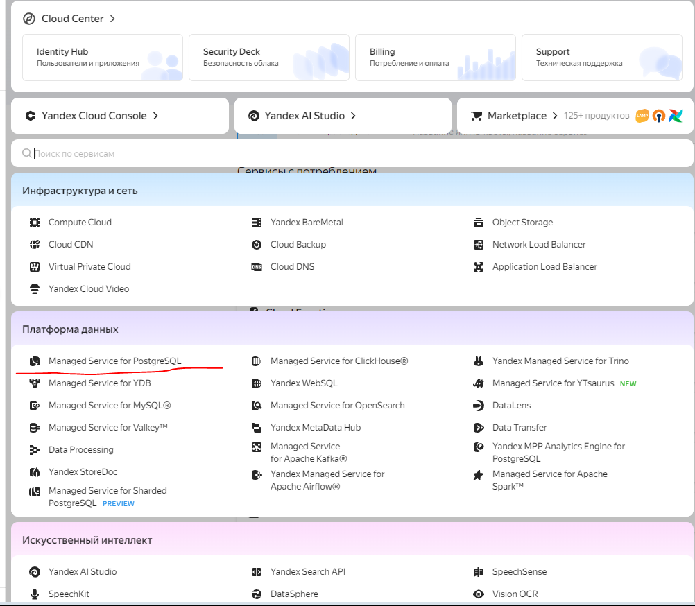
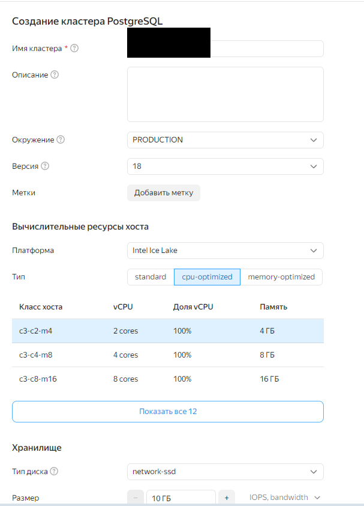
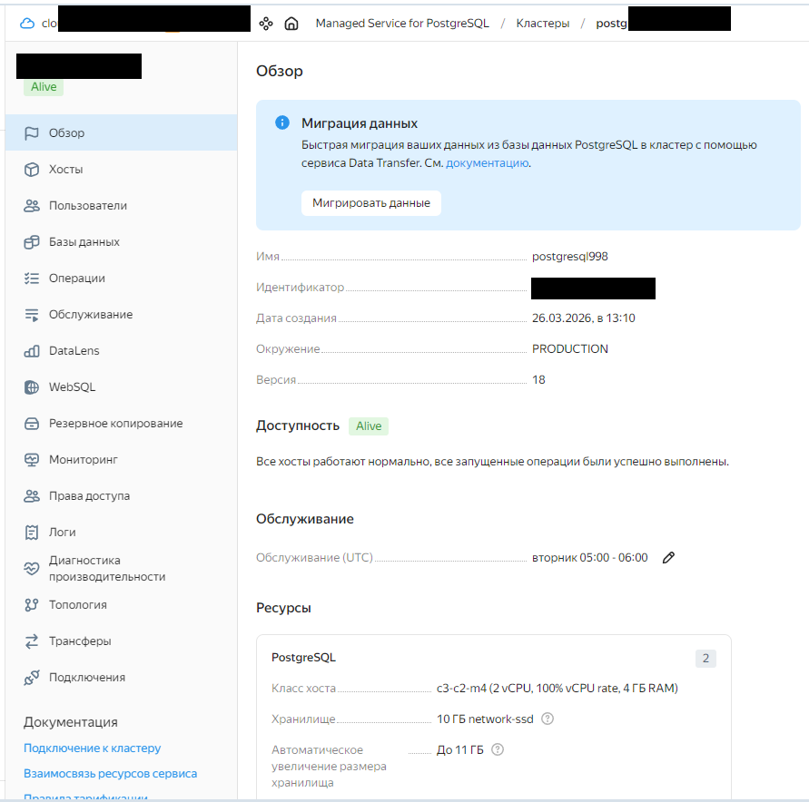
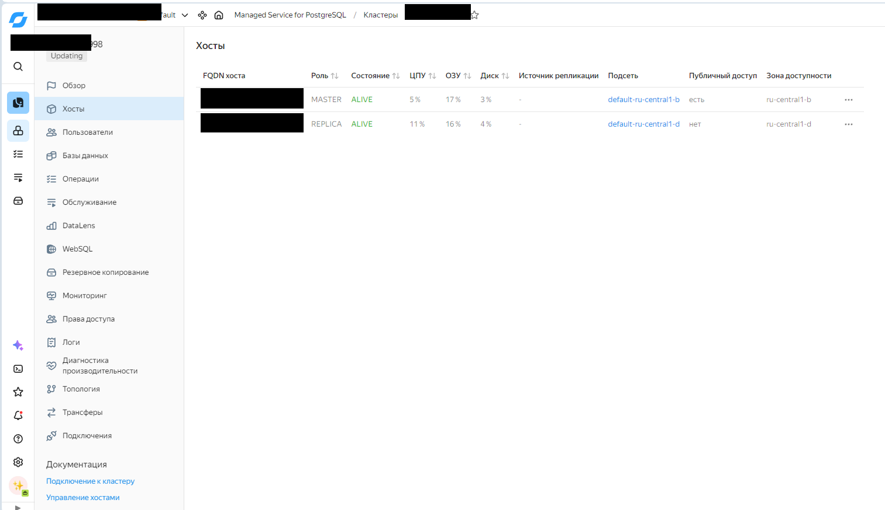
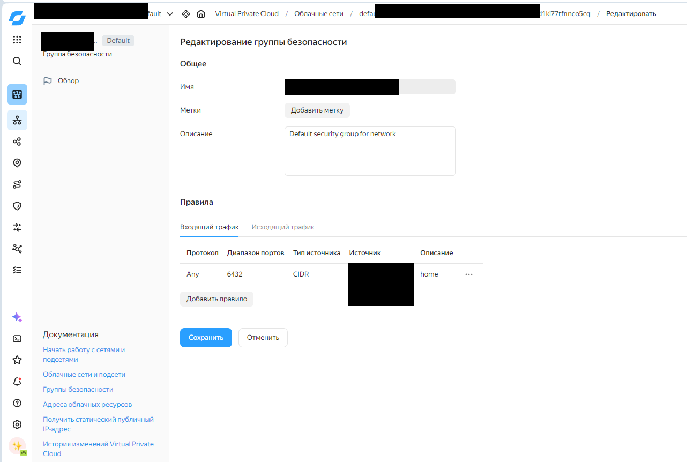
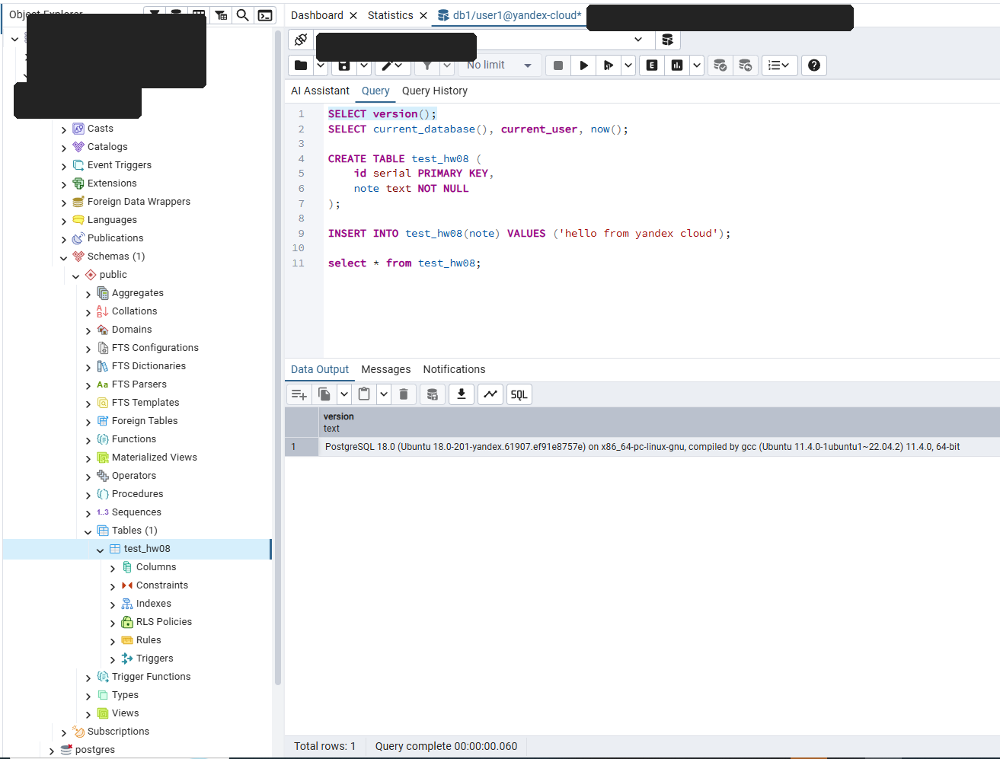

# Домашнее задание №8  
## PostgreSQL и Yandex Cloud: Managed Service for PostgreSQL

> **Цель:** получить базовые навыки создания и подключения к кластеру PostgreSQL в **Yandex Cloud Managed Service for PostgreSQL**.  
> **Примечание:** на скриншотах ниже чувствительные данные скрыты.

## Что было сделано

В рамках задания был развернут кластер **Managed Service for PostgreSQL** в **Yandex Cloud**, после чего выполнена настройка сетевого доступа и проверено подключение к базе данных с локального компьютера через **pgAdmin 4**.

Подтверждено:
- кластер успешно создан и перешел в состояние **Alive**;
- включен **публичный доступ** для master-хоста;
- настроено правило в **Security Group** для подключения только с домашнего внешнего IP по порту **6432**;
- выполнено успешное подключение к базе данных из локальной сети через клиентское приложение.

---

## Параметры кластера

| Параметр | Значение |
|---|---|
| Сервис | Yandex Cloud Managed Service for PostgreSQL |
| Окружение | `PRODUCTION` |
| Версия PostgreSQL | `18` |
| Количество хостов | `2` |
| Роли хостов | `MASTER` + `REPLICA` |
| Класс хоста | `c3-c2-m4` |
| Ресурсы хоста | `2 vCPU`, `4 GB RAM` |
| Тип диска | `network-ssd` |
| Размер хранилища | `10 GB` |
| Автоувеличение диска | до `11 GB` |
| Зоны доступности | `ru-central1-b`, `ru-central1-d` |
| Публичный доступ | включен для `MASTER` |
| Доступ извне | через правило Security Group на порт `6432` |

---

## Ход выполнения

### 1. Выбор сервиса в консоли Yandex Cloud

В консоли Yandex Cloud был выбран сервис **Managed Service for PostgreSQL**.



### 2. Создание кластера PostgreSQL

При создании кластера были выбраны:
- окружение `PRODUCTION`;
- версия PostgreSQL `18`;
- класс хоста `c3-c2-m4`;
- тип диска `network-ssd`;
- размер хранилища `10 GB`.



### 3. Проверка состояния кластера

После создания кластер успешно развернулся и перешел в состояние **Alive**.



### 4. Проверка хостов и публичного доступа

В кластере были созданы два хоста:
- `MASTER`;
- `REPLICA`.

Для подключения с локального компьютера был включен **публичный доступ** к master-хосту.



### 5. Настройка Security Group

Для внешнего подключения был настроен входящий доступ:
- протокол: `Any` (порт `6432`);
- источник: **мой внешний IP /32**;
- назначение: доступ к PostgreSQL только с домашнего адреса.

> Для production-сценария безопаснее указывать протокол `TCP`, но для целей лабораторной работы доступ по порту `6432` был успешно ограничен домашним внешним IP.



### 6. Подключение к базе данных через клиент

После настройки публичного доступа и Security Group было выполнено успешное подключение к кластеру через **pgAdmin 4** с локального компьютера.  
В клиенте доступна база данных, схема `public` и стандартные объекты PostgreSQL. Дополнительно был выполнен тестовый запрос `SELECT version();`, подтверждающий работоспособность подключения, а также создана тестовая таблица `test_hw08`.



---

## Подключение через `psql`

Для подключения из консоли можно использовать команду следующего вида:

```bash
psql "host=<FQDN_MASTER_HOST> port=6432 sslmode=verify-full dbname=db1 user=user1 target_session_attrs=read-write"
```

Перед подключением требуется сохранить корневой сертификат Yandex Cloud в локальное хранилище сертификатов PostgreSQL (`root.crt` / `CA.pem`).

---

## Проверка работоспособности

Для проверки подключения и доступности кластера можно выполнить следующие запросы:

```sql
SELECT version();

SELECT current_database(), current_user, now();
```

Также для дополнительной проверки можно создать тестовую таблицу:

```sql
CREATE TABLE test_hw08 (
    id serial PRIMARY KEY,
    note text NOT NULL
);

INSERT INTO test_hw08(note) VALUES ('hello from yandex cloud');

SELECT * FROM test_hw08;
```

---

## Итог

В рамках домашнего задания:
- развернут кластер **Managed Service for PostgreSQL** в **Yandex Cloud**;
- настроен внешний доступ к кластеру;
- ограничен доступ по **Security Group** с домашнего IP;
- успешно выполнено подключение к базе данных через **pgAdmin 4** с локальной машины.

Задание подтверждает базовые навыки работы с **Managed PostgreSQL** в облаке: создание кластера, настройку сетевого доступа и подключение клиентским приложением.
